# Developer Guide

## Acknowledgements
We, team CS2113-T09-2, acknowledge the use of the following sources in our tP.

| Source                                                                                              | Extent of reuse                                                                                                                                                                                                                                                                                                                                                                                                                                                                                                                                                                                                                                                                                                                                                                                                                                 | 
|:----------------------------------------------------------------------------------------------------|:------------------------------------------------------------------------------------------------------------------------------------------------------------------------------------------------------------------------------------------------------------------------------------------------------------------------------------------------------------------------------------------------------------------------------------------------------------------------------------------------------------------------------------------------------------------------------------------------------------------------------------------------------------------------------------------------------------------------------------------------------------------------------------------------------------------------------------------------|
| **[AddressBook-Level2 (AB2)](https://github.com/se-edu/addressbook-level2/)**                       | The class Child was inspired by the Person class of AB2. The class EditCommandTest was inspired by the AddCommandTest class of AB2.   The class ClausControl was adapted from the Main class of AB2 with some modifications. The class Command was adapted from the addCommand class of AB2 with some modifications. The class ChildCommand was adapted from the AddCommand class of AB2 with some modifications.  The class TextUi was reused from the TextUi class of AB2 with minor modifications. The class IllegalValueException was reused from the IllegalValueException class of AB2 with minor modifications. The class Name was reused from the Name class of AB2 with minor modifications. The class ReadOnlyChild was reused from the ReadOnlyPerson class of AB2 with minor modifications. | 
| **[AddressBook-Level3 (AB3)](https://github.com/se-edu/addressbook-level3/)**                       | The docs of our tP (AboutUs, README, UG, DG & PPPs) were made with reference to the AB3 application's docs.                                                                                                                                                                                                                                                                                                                                                                                                                                                                                                                                                                                                                                                                                                                                     |
| **[iP (author: shrabasti-c)](https://github.com/shrabasti-c/ip)**                       | The structure of class ChildCommand was adapted from the *Command classes of shrabasti-c's iP with some modifications.                                                                                                                                                                                                                                                                                                                                                                                                                                                                                                                                                                                                                                                                                                                          |
| **[GeeksforGeeks JUnit tests](https://www.geeksforgeeks.org/advance-java/unit-testing-of-system-out-println-with-junit/)**                      | The class ClausControlTest was inspired by the JUnit tests on the aforementioned website.                                                                                                                                                                                                                                                                                                                                                                                                                                                                                                                                                                                                                                                                                                                                                       |
| **ChatGPT**                                                                                         | The load() function of Storage class and find command were written with the aid of ChatGPT.   The prepareAdd() and prepareEdit() functions of the Parser class (along with their refactored helpers) were reused from ChatGPT with significant modifications. ChatGPT was also used for trivial debugging.                                                                                                                                                                                                                                                                                                                                                                                                                                                                                                                                  |
| **Claude**                                                                                          | The tool was used for trivial debugging of ParserTest class and elf-related commands after a merge conflict, and to refine the DG language.                                                                                                                                                                                                                                                                                                                                                                                                                                                                                                                                                                                                                                                                                                     |

## Design
### Architecture
The bulk of the app’s work is done by the following five components:

* Main (ClausControl.java): Starts the application and runs the command loop until termination.
* Storage: Reads data from, and writes data to, the hard disk.
* Data: Responsible for storing relevant entities in ClausControl.
* Parser: Takes in user input and executes commands.
* (trivial implementation) Ui: The Ui of the App.

The Architecture Diagram given below explains the high-level design of the App.

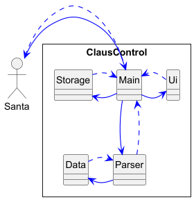

The Sequence Diagram below shows how the components interact with each other for the scenario where the user issues the command delete 1.

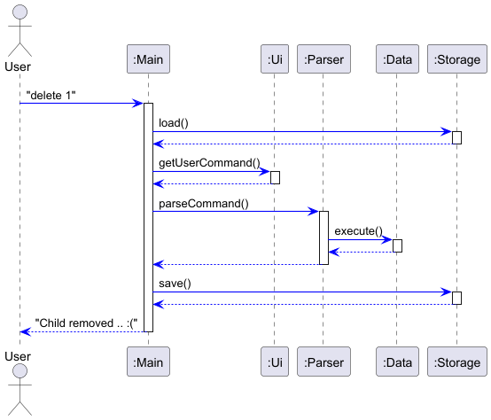

It should be noted that the components Main and Data are representative in nature.
The Main component refers to the ClausControl.java class and the Data component refers to packages in our project representing different entities.
They have been grouped under Main and Data to reflect the architecture of the project.
The sections below give more details of the major components.

## Storage Component
**API:** `Storage.java`

#### Overview
The Storage component is responsible for managing persistent data in ClausControl.
It handles saving and loading of  data such as:
- Children and their associated gifts and actions
- Elves and their assigned tasks
- Todo items
Data is stored in a file and loaded back into the system when the application starts.
The class diagram is-

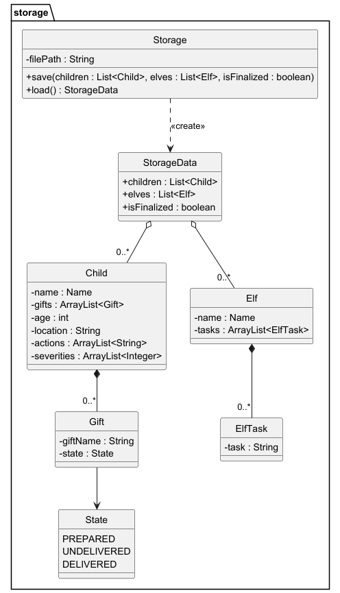

#### Implementation
**Saving data**
The save() method writes the lists into a .txt file in a structured format.
1. Each child's name is written with the CHILD tag.
2. The corresponding gifts of the child are written just below it with the GIFT tag.
3. The child's actions and severities are stores with the ACTION tag.
4. Each elf is written with the ELF tag.
5. The corresponding elf tasks are written under it with the TASK tag.

**Loading data**
The load() method reconstructs data from the .txt file.
1. It reads the file line by line.
2. Each line is split with a delimiter.
3. Processes:
   "CHILD" → creates new Child
   "GIFT" → creates new Gift and restores the status of the gift.
   "ACTION" → restores an action and its severity
   "ELF" → creates a new Elf
   "TASK" → adds a ElfTask
4. Restores gift state:
   PREPARED → markPrepared()
   DELIVERED → markDelivered()
   default → remains UNDELIVERED
5. Adds gift to the current child
Below is the sequence diagram-

#### Design
The storage component provides a unified interface (`Storage.java`) that handles the storage related operations.

#### Usage
- When the application starts, data is loaded from storage.
- When the user inputs commands,the resulting data changes are saved.

#### Notes
- Storage is independent of the command execution logic
The storage component does not handle user inputs. The Logic layer interacts with Storage through its public methods- 
save() and load() only. The Storage component does not know how data is handled internally.

## Data Component
**API:** `seedu/clauscontrol/data`

#### Overview
The Data component is responsible for storing relevant entities in ClausControl.

It comprises Class representations of:
- Children 
- Elves 
- Todo items
- Gifts
- Exceptions

#### Responsibilities
The Data component houses all possible interacting entities (domain objects) of the application.
Some, or all, of the following operations:
- creation
- modification
- viewing
- deletion
can be performed on the Data component's entities via command logic.

#### Implementation
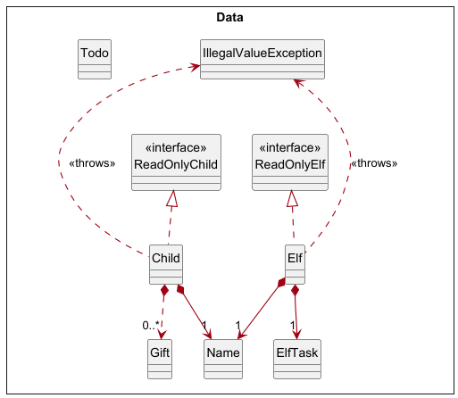 
  
The Data components interact in the following manner:
- Child entity comprising Name and further Gift(s), implementing ReadOnlyChild and throwing IllegalValueException
- Elf entity comprising ElfTask and Name, implementing ReadOnlyElf and throwing IllegalValueException
- Standalone Todo implemented to represent todo actions

#### Design
The Data component provides a unified interface that handles the data related operations.
It implements encapsulation, immutability, and separation of concerns in terms of validation.

#### Usage
- When the application starts, data is loaded from storage.
- Other components interact with the Data entities after command execution is initiated.

## Parser Component
**API:** `Parser.java`

#### Overview
The `Parser` component takes in the user input and converts it into executable commands.

The Parser determines:
- The type of command to execute.
- The parameters associated with the command.

#### Responsibilities
The Parser component:
- Parses user inputs into command object.
- Checks input format.
- Handles incorrect inputs by throwing exceptions.

#### Implementation
The `Parser` class identifies commands with keywords and parameters with prefixes, in the user input .
Examples of supported commands include:
- `child n/NAME l/LOCATION a/AGE`
- `gift CHILD_INDEX g/GIFT_NAME`
- `action CHILD_INDEX a/ACTION s/SEVERITY`
- `elf n/NAME`
- `todo d/DESCRIPTION by/DATE`

#### Design
The Parser follows a command-based design:
1. Identify the command keyword (e.g. `child`, `gift`, `edit`).
2. Extract parameters using prefixes.
3. Validate inputs.
4. Return the corresponding `Command` object.

#### Error Handling
The Parser throws `IllegalValueException` when:
- Compulsory parameters are missing.
- Duplicate parameters are provided.
- Invalid prefixes are used.

#### Sequence Diagram
The following diagram shows how user input is processed by the Parser.
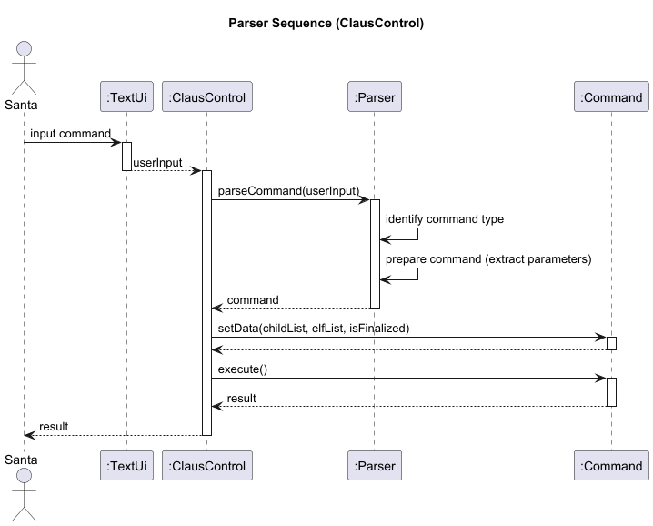

#### Class Diagram
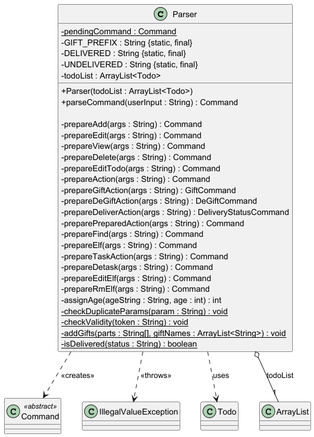

## Design & implementation
### Child Feature

#### Use Case 
Below is a system-wide use case to illustrate the child profile and its associated actions.

Within the Child Feature, Santa can interact with the `child` profile using the following commands: `child`, `view`, `edit`, `delete`. 
These commands can be used in conjunction with the `childlist` command.
Given below is an example usage scenario: 

**A.** Santa, at the beginning of the year, adds children to his system.
1. child n/Bruce a/25
2. child n/Diana l/Washington DC
3. child n/Clark 

**B.** Santa, later in the year, consults the list of children and their individual profiles as and when necessary.

He makes updates when needed as well.
1. childlist
2. view 3
2. edit 3 n/Kal El
3. delete 1

**C.** Santa, throughout the year, adds actions to children's profiles with associated severities in the range [-5, 5].
Each child has a total score attribute that is the sum of his/her action severities. This score determines which of Santa's lists they end up in (naughty/nice)
1. action 1 a/helped grandma s/2
2. action 1 a/did homework s/5
3. action 2 a/was rude to classmate s/-1

One can observe that child 1 with total score 3 ends up in the nice list whereas child 2 ends up in the naughty one.
However, Santa can `reassign` kids to different lists as well, for instance moving child 2 from naughty to nice.

**D.** Nearing Christmas, Santa freezes the lists, after which gifts can be assigned and no more actions can be added.

#### Implementation
As mentioned earlier, the `child` command creates a child entity/profile consisting of its name (minimally) as well as age and location.
As the implementation of `child` is the most complex of its related commands (`child`, `view`, `edit`, `delete`), let us examine the same.

The proposed child profile is facilitated by `Child` Class.
It implements `ReadOnlyChild` which contains a name fetching mechanism, the name being stored internally via a `Name` class with a reference to a `name` String input by the user.
The child operation must minimally have a name argument i.e. location, age are optional.
Additionally, it implements the following operations:
* `toAdd()`—adds the child to the internal child list.
* `execute()`—returns a successful operation message.
  These operations comprise the `ChildCommand` class (which inherits from a base `Command` class).
  Given below is an example usage scenario and how the add child mechanism behaves at each step.
1. The user launches the application for the first time.
2. The user executes `child n/Bruce Wayne` to add a child in the child list.
3. The Parser parses the command and returns the arguments to a new `ChildCommand`.
4. Given a valid Name the `Child` object is instantiated and returned.
* Note: At the point of instantiation the Name is validated. An incorrect input means the object creation does not proceed.
5. The `Child` is added to the Child List.
6. The successful message is displayed.

Given below is a sequence diagram describing the child operation.

**Aspect:** How to implement the Child Profile
- **Alternative 1 (current choice):** Construct a `ReadOnlyChild` interface which `Child` implements
    - **Pros:** Ensures no external access as well as immutability
    - **Cons:** More lines of code and more complex implementation (extra interface)

- **Alternative 2:** Implement via a Single `Child` Class
    - **Pros:** Lesser lines of code and simpler implementation
    - **Cons:** Higher risk of child data modification

**Aspect:** How to store the Child Name
- **Alternative 1 (current choice):** Store as `Name` class
    - **Pros:** Ensures validation at time of object creation
    - **Cons:** More lines of code and more complex implementation (extra class)

- **Alternative 2:** Store as `String` in `Child` class
    - **Pros:** Lesser lines of code and simpler implementation
    - **Cons:** No enforced validation and violation of Separation of Concerns

#### Implementation of `view`, `edit`, and `delete` 
The aforementioned commands follow a near identical sequence diagram to the Child Command differing only in their execute() methods.
It should be noted that a child cannot be edited after the finalize command, however new children can be added even after the finalize command.

### Finalize Feature

#### Overview
The `finalize` command freezes the nice and naughty lists, preventing further
action changes and reassignments, while enabling gift allocation.

#### Use Case
Given below is an example usage scenario:

1. Santa adds children: `child n/Tom`, `child n/Lucy`
2. Santa records actions: `action 1 a/helped grandma s/2`, `action 2 a/broke window s/-3`
3. Santa tries to add a gift before finalizing: `gift 1 g/toy`
    - Expected: Blocked with message to finalize first
4. Santa finalizes: `finalize`
    - Expected: Lists are now frozen
5. Santa tries to add another action: `action 1 a/test s/1`
    - Expected: Blocked with message
6. Santa adds a gift: `gift 1 g/toy`
    - Expected: Gift added successfully

#### Implementation
The finalize feature uses a boolean flag `isFinalized` stored in `ClausControl.java`.
This flag is passed to every command via `setData()` in `Command.java`.
When the user types `finalize`, `FinalizeCommand.execute()` returns a success message.
`ClausControl` then detects it via `instanceof FinalizeCommand` and sets the flag to `true`.

`ActionCommand`, `GiftCommand` and `ReassignCommand` each check `isFinalized`
at the start of `execute()`. Once finalized, action additions and reassignments
are blocked. Gift allocation is also blocked before finalization.

Given below is a sequence diagram showing how the finalize command works.

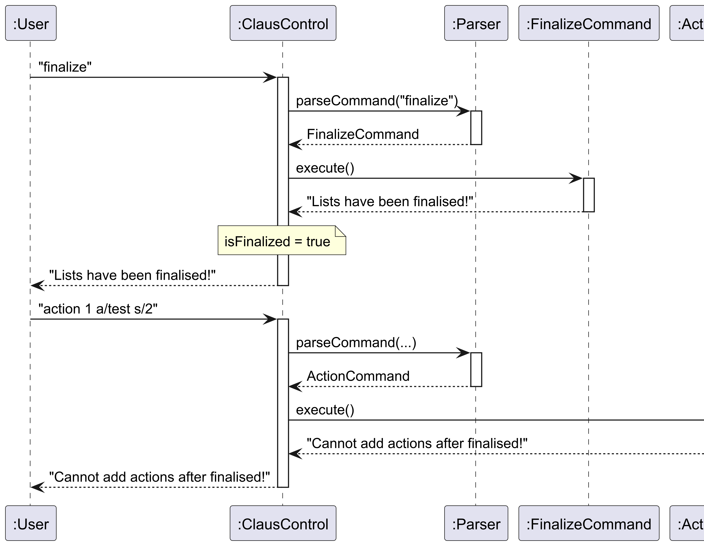

**Aspect:** How to detect when finalize is called
- **Alternative 1 (current choice):** Use `instanceof FinalizeCommand` in `ClausControl.java`
    - **Pros:** Keeps `FinalizeCommand` simple and focused; no extra coupling between classes
    - **Cons:** Detection logic lives in the main class rather than the command itself

- **Alternative 2:** Use a static boolean flag in a shared utility class
    - **Pros:** Accessible anywhere without needing to pass the flag through `setData()`
    - **Cons:** Static state is harder to test and harder to reset between test runs

**Aspect:** How to pass the finalized state to commands
- **Alternative 1 (current choice):** Pass `isFinalized` as a parameter in `setData()`
    - **Pros:** Clean, testable - each command test can set the flag explicitly
    - **Cons:** All commands must accept and store the flag even if unused

- **Alternative 2:** Use a mutable wrapper object shared across commands
    - **Pros:** Single source of truth
    - **Cons:** Less readable, harder to reason about state changes

### Action Tracking Feature

#### Overview
The `action` command allows Santa to record a good or bad action for a child
with an associated severity score between -5 and 5.

#### Use Case
Given below is an example usage scenario:

1. Santa adds a child: `child n/Tom`
2. Santa records a good action: `action 1 a/helped grandma s/2`
    - Expected: Action recorded, Tom's total score is now 2
3. Santa records a bad action: `action 1 a/broke window s/-3`
    - Expected: Action recorded, Tom's total score is now -1
4. Santa views the naughty list: `naughty`
    - Expected: Tom appears on the naughty list
5. Santa tries to add an action after finalize:
    - Expected: Blocked with error message

#### Implementation
Each `Child` object stores two parallel `ArrayList`s - one for action descriptions
and one for severity scores. `getTotalScore()` sums all severities to determine
if the child is on the nice (score >= 0) or naughty (score < 0) list.

The following steps occur when adding an action:
1. Parser extracts the child index, action description and severity.
2. `ActionCommand` checks if the lists are finalised. If so, the action is blocked.
3. The child index is validated against the child list bounds.
4. The action and severity are added to the child via `addAction()`.

Format: `action CHILD_INDEX a/ACTION s/SEVERITY`

Given below is a sequence diagram showing how the action command works.

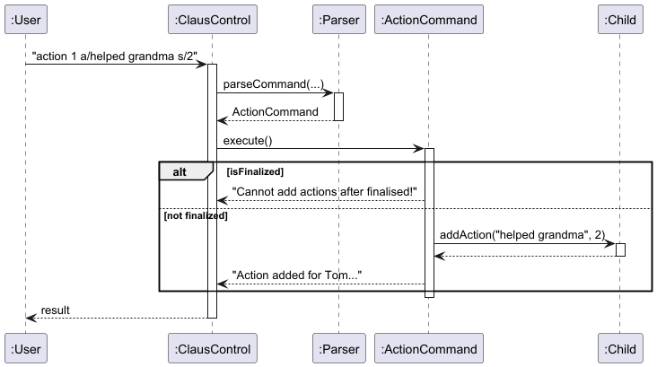

**Aspect:** How to store actions and severities
- **Alternative 1 (current choice):** Two parallel `ArrayList`s in `Child`
    - **Pros:** Simple implementation; `getTotalScore()` is a straightforward loop
    - **Cons:** Must ensure both lists stay in sync; less object-oriented

- **Alternative 2:** A single `ArrayList` of `Action` objects each holding description and severity
    - **Pros:** More object-oriented; easier to extend with additional fields
    - **Cons:** Adds an extra class and slightly more complexity

**Aspect:** Where to enforce severity range validation
- **Alternative 1 (current choice):** Validate in `Parser` before creating the command
    - **Pros:** Fails fast; no invalid command objects are created
    - **Cons:** Validation logic is in the parser rather than the domain class

- **Alternative 2:** Validate inside `ActionCommand.execute()`
    - **Pros:** Keeps parser simpler
    - **Cons:** Invalid command objects can be created and partially executed

### Nice and Naughty List Feature

#### Overview
The `nice` and `naughty` commands list all children whose total action score
is >= 0 or < 0 respectively. Manual overrides via `reassign` take priority
over the score-based classification.

#### Use Case
Given below is an example usage scenario:

1. Santa adds children: `child n/Tom`, `child n/Lucy`
2. Santa adds actions: `action 1 a/helped grandma s/2`, `action 2 a/broke window s/-3`
3. Santa views the nice list: `nice`
    - Expected: Tom appears (score 2)
4. Santa views the naughty list: `naughty`
    - Expected: Lucy appears (score -3)
5. Santa manually reassigns Lucy: `reassign 2 l/nice`
6. Santa views the nice list again: `nice`
    - Expected: Both Tom and Lucy appear (override takes priority)

#### Implementation
Both `NiceCommand` and `NaughtyCommand` loop through the `childList` and call
`isNice()` or `isNaughty()` on each child. These methods check the `listAssignment`
field first. If it is not null, the manual override is used. Otherwise the
total score determines the classification.

Given below is a sequence diagram showing how the nice/naughty commands work.

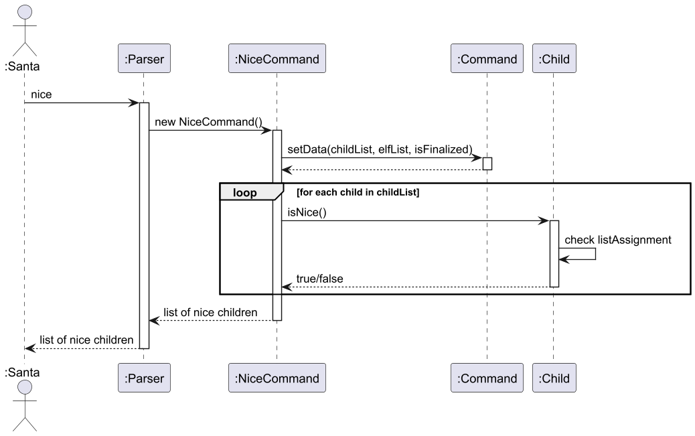

**Aspect:** How to determine a child's list classification
- **Alternative 1 (current choice):** Check `listAssignment` field first, fall back to score
    - **Pros:** Clean priority system; override and auto-classification coexist naturally
    - **Cons:** Two separate code paths to maintain

- **Alternative 2:** Always recompute from score; store override as a score adjustment
    - **Pros:** Single code path
    - **Cons:** Loses the semantic distinction between manual override and score-based classification

### Reassign Feature

#### Overview
The `reassign` command allows Santa to manually override a child's list
assignment to either nice or naughty, regardless of their action score.
Once finalised, reassignment is blocked.

#### Use Case
Given below is an example usage scenario:

1. Santa adds a child and a bad action: `child n/Tom`, `action 1 a/broke window s/-3`
2. Santa views the naughty list: `naughty`
    - Expected: Tom appears
3. Santa reassigns Tom to nice: `reassign 1 l/nice`
    - Expected: Tom now appears on the nice list
4. Santa finalizes: `finalize`
5. Santa tries to reassign again:
    - Expected: Blocked with error message

#### Implementation
`ReassignCommand` calls `setListAssignment()` on the target child, which sets
the `listAssignment` field in `Child`. This field is checked first in `isNice()`
and `isNaughty()`, so it always takes priority over the computed score.

Format: `reassign CHILD_INDEX l/LIST`

Given below is a sequence diagram showing how the reassign command works.

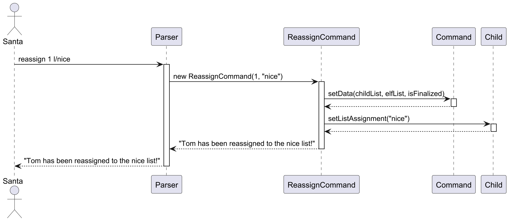

**Aspect:** How to store the manual override
- **Alternative 1 (current choice):** Store as a nullable `listAssignment` String in `Child`
    - **Pros:** null means no override - clean default state with no extra flag needed
    - **Cons:** String comparison needed; must validate "nice"/"naughty" values

- **Alternative 2:** Use an enum for list assignment state (NICE, NAUGHTY, AUTO)
    - **Pros:** Type-safe; no invalid string values possible
    - **Cons:** Slightly more code; AUTO state effectively means the same as null

### Todo and Reminder Feature

#### Overview
The `todo` command allows Santa to add tasks with deadlines. On startup,
any todos due within the next 7 days are automatically shown as reminders.
Todos are persisted across sessions using `TodoStorage`.

#### Use Case
Given below is an example usage scenario:

1. Santa adds a todo: `todo d/Buy wrapping paper by/2026-12-20`
    - Expected: Todo added successfully
2. Santa views all todos: `todolist`
    - Expected: Todo listed with deadline
3. Santa tries to add a todo with a past date: `todo d/Old task by/2020-01-01`
    - Expected: Blocked with error message
4. Santa removes a todo: `removetodo 1`
    - Expected: Todo removed
5. Santa restarts the app with a todo due within 7 days:
    - Expected: Reminder shown automatically on startup

#### Implementation
Each `Todo` stores a description and a `LocalDate` deadline. `TodoStorage` saves
and loads todos from `todos.txt` using a pipe-separated format.

The following steps occur when adding a todo:
1. Parser extracts the description and deadline from the input.
2. `AddTodoCommand` validates that the description is not empty.
3. `AddTodoCommand` validates that the deadline is not in the past.
4. The todo is added to `todoList` and saved via `TodoStorage`.

On startup, `ClausControl` calls `showUpcomingTodos()` which filters todos
using `isUpcoming()`, showing only those due within 7 days.

Format: `todo d/DESCRIPTION by/YYYY-MM-DD`

Given below is a sequence diagram showing how the todo command works.

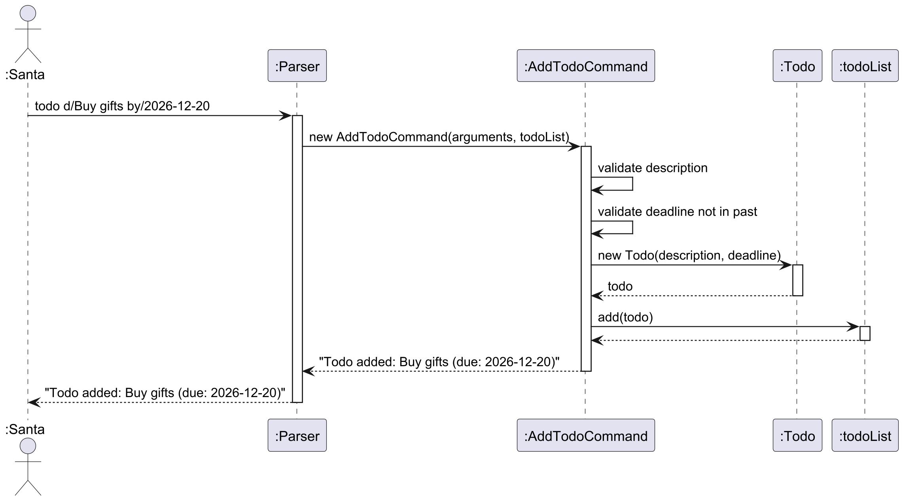

**Aspect:** How to store the deadline
- **Alternative 1 (current choice):** Use `LocalDate`
    - **Pros:** Only date precision needed for deadlines; clean API for date comparisons
    - **Cons:** Cannot store time-specific deadlines if needed in future

- **Alternative 2:** Use epoch seconds (long)
    - **Pros:** Compact storage format
    - **Cons:** Requires manual conversion for display; unnecessary precision for date-only deadlines

**Aspect:** Where to store todos
- **Alternative 1 (current choice):** Separate `todos.txt` file via `TodoStorage`
    - **Pros:** Avoids modifying the existing `Storage` class; clean separation of concerns
    - **Cons:** Two separate storage files to manage

- **Alternative 2:** Store todos in the same `data.txt` file
    - **Pros:** Single file for all data
    - **Cons:** Couples todo storage to the existing format; increases risk of breaking existing storage logic

### Elf Feature 

#### Use Case
Below is a system-wide use case to illustrate the elf profile and its associated actions.

Within the Elf Feature, Santa can interact with the `elf` profile using the following commands: `elf`, `rmelf`, `editelf`, `task`, `detask`, `elflist`.
These commands can be used to manage elves and their assigned tasks.
Given below is an example usage scenario:

**Santa, at the beginning of the year, adds elves to his workshop**
1. elf n/Dobby
2. elf n/Tinsel
3. elf n/Jingle

**Santa, later in the year, consults the list of elves and manages them as needed**
1. elflist
2. editelf e/2 n/Glitter
3. rmelf e/3

#### Implementation
As mentioned earlier, the `elf` command creates an elf entity/profile consisting of its name and an associated task list.
As the implementation of `elf` is the most complex of its related commands (`elf`, `rmelf`, `editelf`), let us examine the same.

The proposed elf profile is facilitated by the `Elf` Class.
It implements `ReadOnlyElf` which contains a name fetching and setting mechanism, with the name stored internally via the reused `Name` class from the child package.
The elf operation must minimally have a name argument; tasks are optional and can be added later.
Additionally, it implements the following operations:
* `toAdd()`—adds the elf to the internal elf list.
* `execute()`—returns a successful operation message.
  These operations comprise the `ElfCommand` class (which inherits from a base `Command` class).
  Given below is an example usage scenario and how the add elf mechanism behaves at each step.
1. The user launches the application for the first time.
2. The user executes `elf n/Dobby` to add an elf to the elf list.
3. The Parser parses the command and returns the arguments to a new `ElfCommand`.
4. Given a valid Name, the `Elf` object is instantiated and returned.
    * Note: At the point of instantiation, the Name is validated via the reused `Name` class. An incorrect input means the object creation does not proceed.
5. The `Elf` is added to the Elf List.
6. The successful message is displayed.

Given below is a sequence diagram showing how the elf command works.

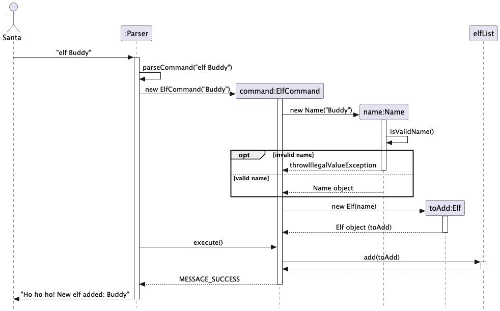

Given below is a sequence diagram showing how the editelf command works.

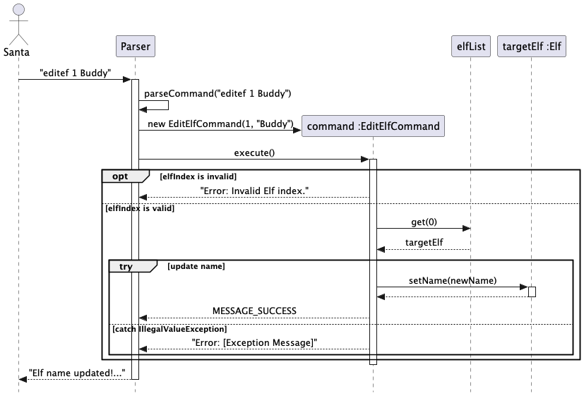

Given below is a sequence diagram showing how the rmelf command works.

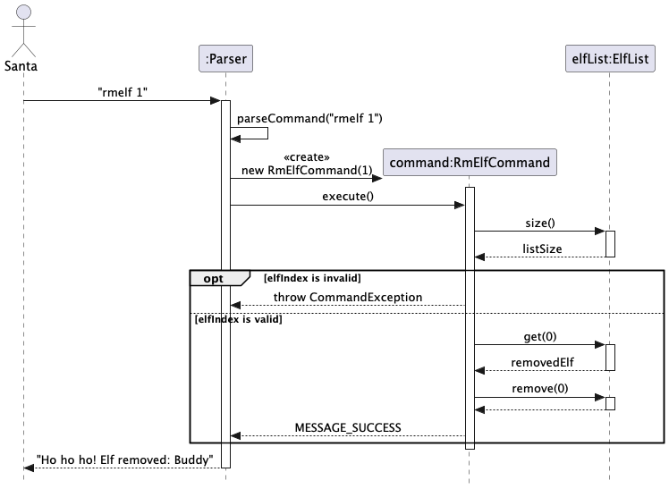

**Aspect:** How to implement the Elf Profile
- **Alternative 1 (current choice):** Construct a `ReadOnlyElf` interface which `Elf` implements
    - **Pros:** Ensures no unintended external mutation of elf data
    - **Cons:** More lines of code and more complex implementation (extra interface)

- **Alternative 2:** Implement via a Single `Elf` Class
    - **Pros:** Lesser lines of code and simpler implementation
    - **Cons:** Higher risk of elf data modification

**Aspect:** How to store the Elf Name
- **Alternative 1 (current choice):** Reuse the existing `Name` class from the `child` package
    - **Pros:** Consistent validation logic across the codebase; avoids code duplication
    - **Cons:** Creates a cross-package dependency between `elf` and `child`

- **Alternative 2:** Store as a `String` in the `Elf` class
    - **Pros:** Lesser lines of code and no cross-package dependency
    - **Cons:** No enforced validation and violation of Separation of Concerns

**Aspect:** How to store Elf Tasks
- **Alternative 1 (current choice):** Store tasks as an `ArrayList<ElfTask>` within `Elf`, with `ElfTask` as a dedicated class
    - **Pros:** Clean encapsulation; easy to add, retrieve, and delete individual tasks by index
    - **Cons:** More classes and slightly more complex than a plain String list

- **Alternative 2:** Store tasks as `ArrayList<String>` directly in `Elf`
    - **Pros:** Simpler implementation with fewer classes
    - **Cons:** No special constraints on task description; future extension (e.g. task priority) would require significant refactoring

#### Implementation of `rmelf`, `editelf`, `task`, `detask`, and `elflist`
The aforementioned commands follow a near identical sequence of operations to the `ElfCommand`, differing only in their `execute()` methods:

* `rmelf` — validates the given elf index, retrieves the `Elf` from the elf list, removes it, and returns a success message with the removed elf's name.
* `editelf` — validates the given elf index, retrieves the target `Elf`, calls `setName()` with a new `Name` object (validated at construction), and returns a success message showing the old and new names.
* `task` — validates the given elf index, retrieves the target `Elf`, creates a new `ElfTask` from the provided description string, calls `addTask()` on the elf, and returns a success message.
* `detask` — validates both the elf index and the task index, retrieves the target `Elf` and its task list, calls `deleteTask()` with the zero-based task index, and returns a success message with the removed task description.
* `elflist` — iterates over all elves in the elf list and builds a formatted string displaying each elf's name and their numbered task list (or a placeholder if no tasks are assigned).

### ElfTask Feature 

#### Use Case

Within the Task Feature, Santa can assign tasks to elves and remove them using the `task` and `detask` commands.
Given below is an example usage scenario:

**Santa assigns tasks to elves throughout the year**
1. task 1 t/wrap gifts
2. task 1 t/polish sleigh
3. task 2 t/sort letters

**Santa removes a specific task from an elf when it is no longer needed**
1. detask e/1 t/2

#### Implementation

The `task` command assigns a task to an existing elf by index. It is facilitated by the `TaskCommand` class (which inherits from the base `Command` class).

Upon construction, `TaskCommand` takes in a 1-based `ELF_INDEX` and a `TASK_DESCRIPTION` string. The `ElfTask` object is created inside `execute()` and immediately added to the target elf's internal `ArrayList<ElfTask>`.

Given below is an example usage scenario and how the assign task mechanism behaves at each step.

1. The user executes `task 1 t/wrap gifts`.
2. The Parser parses the command and passes the elf index and task description to a new `TaskCommand`.
3. `execute()` validates the elf index against `elfList`.
    * If the index is out of range, an error message is returned immediately.
4. The target `Elf` is retrieved from `elfList`.
5. A new `ElfTask` is instantiated with the provided description string.
6. `addTask()` is called on the target `Elf`, appending the `ElfTask` to its internal list.
7. A success message is returned.

Given below is a sequence diagram showing how the task command works.

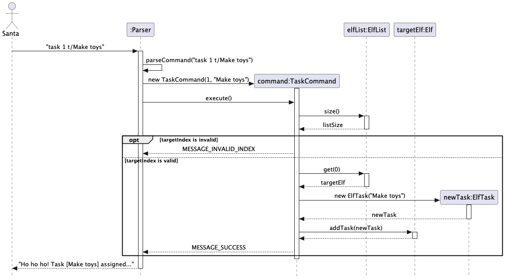

**Aspect:** How to validate the task description
- **Alternative 1 (current choice):** Store task description as a plain `String` in `ElfTask`, with assertion guards (`taskContent != null`, not empty) in `TaskCommand`
    - **Pros:** Simple; no special constraints needed for task descriptions
    - **Cons:** Validation is done at the command level rather than inside `ElfTask` itself

- **Alternative 2:** Introduce a dedicated `TaskDescription` class similar to `Name`
    - **Pros:** Encapsulates validation logic; consistent with the `Name` pattern
    - **Cons:** Added complexity for a field with no special formatting constraints

#### Implementation of `detask`

`detask` removes a specific task from an elf by both elf index and task index. It is facilitated by the `DetaskCommand` class.

`execute()` performs two rounds of validation — first checking the elf index against `elfList`, then checking the task index against the target elf's task list. If either check fails, a descriptive error message is returned. On success, `deleteTask()` is called on the target `Elf` with the 0-based task index, and the removed task description is included in the success message.

Given below is a sequence diagram showing how the detask command works.

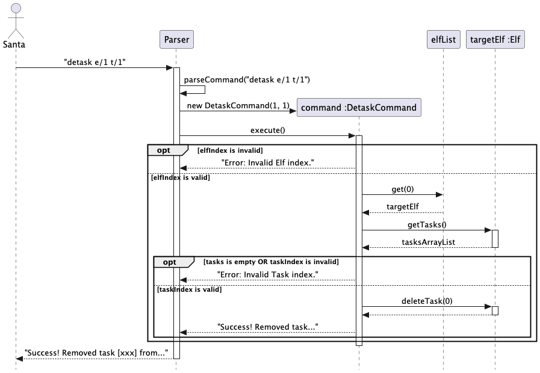
---

### Find Feature

#### Use Case

Within the Find Feature, Santa can search for children in his list by name, age, or location using the `find` command.
Given below is an example usage scenario:

**Santa searches for children matching specific criteria**
1. find n/Bruce
2. find a/10
3. find l/Washington

#### Implementation

The `find` command searches the `childList` and returns all matching entries. It is facilitated by the `FindCommand` class (which inherits from the base `Command` class).

`FindCommand` takes in a `query` string and a `SearchType` enum value (`NAME`, `AGE`, or `LOCATION`). The query is normalised to lowercase at construction time. `execute()` iterates over all children in `childList` and evaluates each child against the search type:

* `NAME` — checks if the child's name (lowercased) contains the query string.
* `AGE` — checks if the child has an age attribute and whether it matches the query exactly.
* `LOCATION` — checks if the child has a location attribute and whether it contains the query string.

Matching children are collected into a formatted result string. If no matches are found, an appropriate message is returned.

Given below is an example usage scenario and how the find mechanism behaves at each step.

1. The user executes `find n/Bruce`.
2. The Parser parses the command and passes `"Bruce"` and `SearchType.NAME` to a new `FindCommand`.
3. `execute()` checks that `childList` is not empty.
4. The command iterates over each `Child` in `childList`, performing a case-insensitive `contains` check on the child's name.
5. All matching children are formatted with their index, name, and any optional age/location attributes.
6. The result string (match count + details) is returned.

Given below is a sequence diagram showing how the find command works.

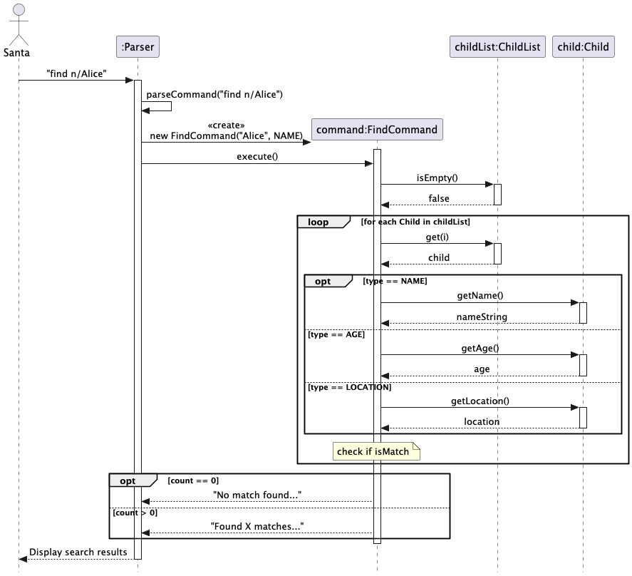

**Aspect:** How to represent search type
- **Alternative 1 (current choice):** Use a `SearchType` enum (`NAME`, `AGE`, `LOCATION`) passed into `FindCommand`
    - **Pros:** Type-safe; easy to extend with new search dimensions; switch-case is exhaustive
    - **Cons:** Requires the Parser to resolve the prefix (`n/`, `a/`, `l/`) to the correct enum value

- **Alternative 2:** Use separate command classes (`FindByNameCommand`, `FindByAgeCommand`, etc.)
    - **Pros:** Each class is self-contained with no branching logic
    - **Cons:** Code duplication; harder to maintain as search logic is identical except for the matching predicate

### List Features 
#### Use Case

Santa can view all children or all elves (with their tasks) at any time using the `childlist` and `elflist` commands.
Given below is an example usage scenario:

**Santa consults the lists as needed throughout the year**
1. childlist
2. elflist

#### Implementation of `childlist`

The `childlist` command displays all children currently in the system. It is facilitated by the `ChildListCommand` class (which inherits from the base `Command` class).

`execute()` first checks if `childList` is empty and returns an early message if so. Otherwise, it iterates over every `Child` in `childList`, appending each child's string representation (name, age, location, score, list assignment) to a `StringBuilder` with a 1-based index prefix. The assembled string is returned as the command output.

Given below is an example usage scenario and how the list mechanism behaves at each step.

1. The user executes `childlist`.
2. The Parser parses the command and invokes `ChildListCommand`.
3. `execute()` checks whether `childList` is empty.
    * If empty, the message `"The child list is empty!"` is returned immediately.
4. The command iterates over each `Child` in `childList`, calling `toString()` on each entry.
5. The formatted list string is returned and displayed to the user.

#### Implementation of `elflist`

The `elflist` command displays all elves and their associated tasks. It is facilitated by the `ElfListCommand` class.

`execute()` mirrors the structure of `ChildListCommand`, but performs a nested iteration: for each `Elf`, it retrieves the elf's `ArrayList<ElfTask>` and appends each task with a nested 1-based index. If an elf has no tasks, a `[No tasks assigned]` placeholder is shown instead.

Given below is an example usage scenario and how the mechanism behaves at each step.

1. The user executes `elflist`.
2. The Parser parses the command and invokes `ElfListCommand`.
3. `execute()` checks whether `elfList` is empty.
    * If empty, the message `"The elf list is empty!"` is returned immediately.
4. The command iterates over each `Elf` in `elfList`:
    * The elf's name is appended with a 1-based index.
    * If the elf has tasks, each task is appended with a nested index under a `Tasks:` label.
    * If the elf has no tasks, `[No tasks assigned]` is appended instead.
5. The formatted list string is returned and displayed to the user.
   
Given below is a sequence diagram showing how the list(elflist and childlist) command works.

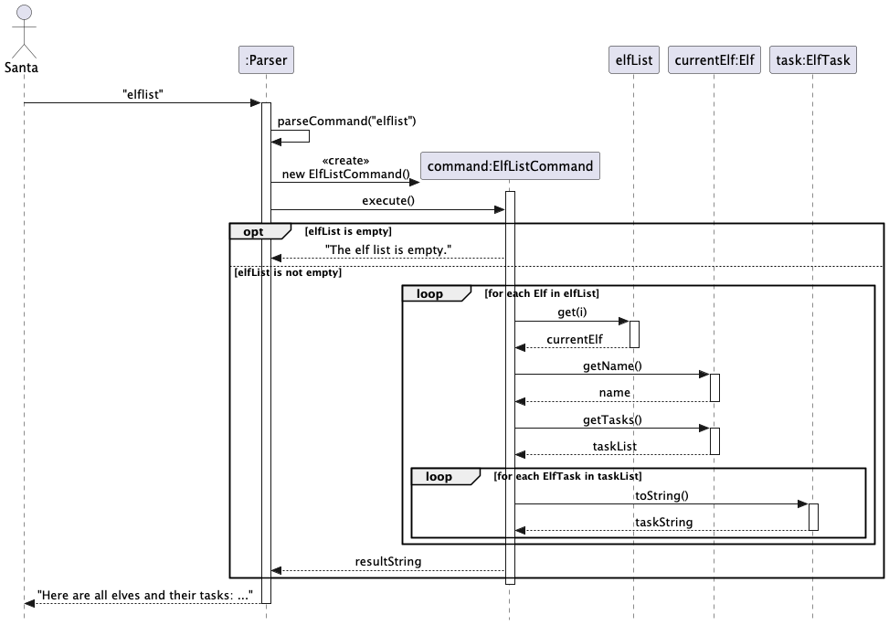
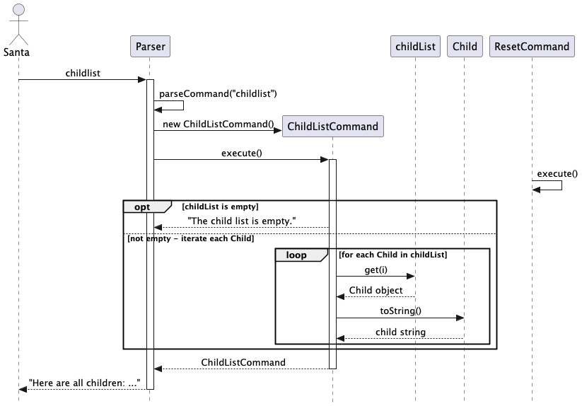

**Aspect:** How to handle elves with no tasks
- **Alternative 1 (current choice):** Display a `[No tasks assigned]` inline placeholder
    - **Pros:** Always shows all elves regardless of task state; Santa can see the full workshop roster at a glance
    - **Cons:** Slightly more output when many elves are unassigned

- **Alternative 2:** Only display elves that have at least one task
    - **Pros:** Shorter output when most elves are idle
    - **Cons:** Santa cannot identify which elves are unassigned from the list view alone

### Reset Feature 

#### Use Case

Santa can fully reset the system at any time using the `reset` command, clearing all children and elves (along with their associated gifts and tasks).
Given below is an example usage scenario:

**Santa resets the system at the start of a new year**
1. reset

#### Implementation

The `reset` command wipes the entire system state. It is facilitated by the `ResetCommand` class (which inherits from the base `Command` class).

`execute()` performs three operations in sequence:
1. Sets the `isFinalized` flag to `false`, unlocking the system for new additions (reversing any prior `freeze` operation).
2. Calls `clear()` on `childList` if it is not null, removing all children and their associated data.
3. Calls `clear()` on `elfList` if it is not null, removing all elves and their associated tasks.

A success message is returned confirming the reset.

Given below is an example usage scenario and how the reset mechanism behaves at each step.

1. The user executes `reset`.
2. The Parser parses the command and invokes `ResetCommand`.
3. `execute()` sets `isFinalized` to `false`.
4. `childList.clear()` is called, removing all child entries.
5. `elfList.clear()` is called, removing all elf entries.
6. The success message is returned and displayed to the user.

Given below is a sequence diagram showing how the reset command works.

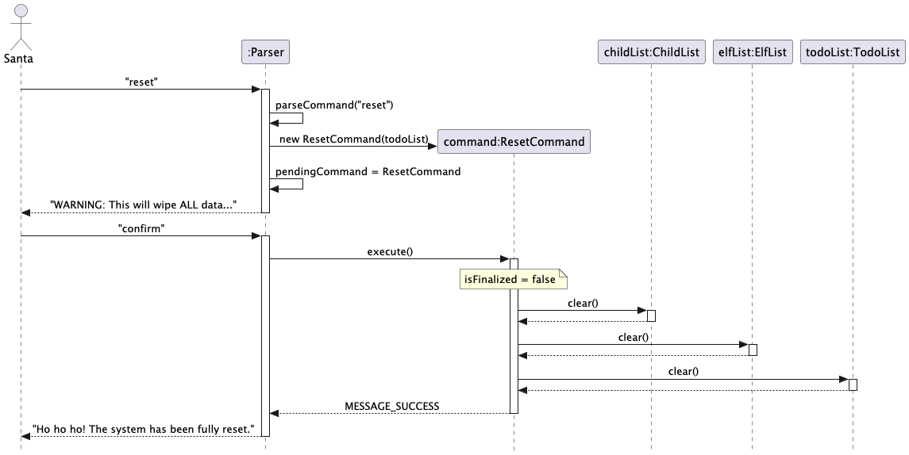

**Aspect:** How to handle null lists during reset
- **Alternative 1 (current choice):** Guard each `clear()` call with a null check
    - **Pros:** Prevents `NullPointerException` if `reset` is called before either list is initialised
    - **Cons:** Slight defensive overhead; in normal application flow the lists are always initialised at startup

- **Alternative 2:** Assert both lists are non-null before clearing
    - **Pros:** Fails fast and loudly if the application state is unexpectedly broken
    - **Cons:** Less robust in edge cases such as testing or partial initialisation scenarios

### Add gift feature

#### Overview
The gift feature allows Santa to assign one or a list of gifts to a child. The gifts are assigned "in progress" status on assignment.
This allows Santa to manage the gifts assigned to children.

#### Use Case
**Santa adds a gift or a list of gifts to a particular child index**
1. gift 1 g/toy
2. gift 3 g/toy g/book g/chocolate

#### Implementation
This feature is implemented with the GiftCommand class.
When Santa enters "gift [child index] g/[gift name]" the Parser extracts the following-
1. The child index
2. The list of gifts prefixed with g/.

A GiftCommand object is created with the above parameters.
The following steps occur-
1. The command checks whether the lists have been finalised.
2. The child index is checked to ensure it is a numeral.
3. The child is retrieved from childList.
4. For each gift, a new Gift object is created and the gift is added to the child with addGift() method.
5. The gift is assigned the "in progress" status upon assignment.

#### UML Diagram- Sequence Diagram
Given below is the sequence diagram

**Aspect:** How to implement the Gift feature
  - **Alternative 1 (current choice):** Allowing multiple gifts to be added in one command
    - **Pros:** User friendly as it supports multiple entries at once.
    - **Cons:** Parsing is complex.
  - **Alternative 2:** Allow single gift assignment per command.
    - **Pros:** Implementing this feature is simpler.
    - **Cons:** Not as user-friendly since multiple assignment is not supported.

### Degift feature

#### Overview
This feature allows Santa to remove a gift for a particular child. This is useful since it helps Santa update the giftlist.

#### Use Case
**Santa removes a gift using the gift index for a particular child index.**
**Only gifts assigned as prepared/undelivered can be degifted.**
1. degift 1 1
The command removes the first gift of the first child.

#### Implementation
This feature is implemented with the DeGiftCommand class.
When Santa enters "degift [child index] [gift index]" the Parser extracts the following-
1. The child index
2. The gift index

A DeGiftCommand object is created with the above parameters.
The following steps occur- 
1. The child index is checked to ensure it is a numeral.
2. The child is retrieved from childList.
3. The command validates the gift index.
4. The gift is removed from the child's gift list.
5. The gift is removed using remove(giftIndex-1)

Appropriate error messages are returned in case a check fails.

#### UML Diagram- Sequence Diagram
Given below is the sequence diagram

**Aspect:** How to implement the DeGift feature
  - **Alternative 1 (current choice):** Remove gift from child list
    - **Pros:** Simple to implement.
    - **Cons:** Requires proper error handling
  - **Alternative 2:** Remove gift by name
    - **Pros:** User friendly as the user need not refer to indexes.
    - **Cons:** Increases complexity of the code.

### Gift delivery status

#### Overview
This feature allows Santa to set the gift status as delivered or undelivered. This is useful as it allows Santa to plan the gift deliveries by
updating the delivery status.

#### Use Case
Santa assigns the delivery status of the gift with the child index and gift index.
**Santa can assign a gift as delivered or undelivered.**
**Gifts are assigned undelivered by default.**
1. delivery_status 1 1 d/delivered
2. delivery_status 1 3 d/undelivered

#### Implementation
This feature is implemented with the DeliveryStatusCommand class.
When Santa enters "delivery_status [child index] [gift index] d/delivered/undelivered" the Parser extracts the following-
1. The child index
2. The gift index
3. delivery status

A DeliveryStatusCommand object is created with the above parameters.
The following steps occur-
1. The child index is checked to ensure it is a numeral.
2. The child is retrieved from childList.
3. The command validates the gift index.
4. The gift is retrieved from the child's giftlist.
5. The gift status is updated- markDelivered() if delivered=true and markUndelivered() when delivered=false;

Appropriate error messages are returned in case a check fails.

#### UML Diagram- Sequence Diagram
Given below is the sequence diagram which describes the happy path.

**Aspect:** How to implement the Delivery Status feature
  - **Alternative 1 (current choice):** Use a boolean variable to determine action
    - **Pros:** Simple to implement.
    - **Cons:** Less intuitive as the parameter is not clearly understandable without looking at it's implementation.
  - **Alternative 2:** Using two command objects for delivered and undelivered actions.
    - **Pros:** User friendly.
    - **Cons:** Breaks encapsulation.

### Prepare Gift Feature

#### Overview
This feature allows Santa to set a gift status as prepared. This is to indicate that the gift is prepared and not delivered yet.
This allows Santa to track the progress of gifts.

#### Use Case
**Santa can assign a gift as prepared for a gift with the corresponding child index and gift index**
1. prepared 1 1
2. prepared 2 1

#### Implementation
This feature is implemented with the PrepareGiftCommand class.
When Santa enters "prepared [child index] [gift index] " the Parser extracts the following-
1. The child index
2. The gift index

A PrepareGiftCommand object is created with the above parameters.
The following steps occur-
1. The command retrieves the child from the childlist.
2. The list of gifts are retrieved using the getGifts() method.
3. The gift as per the specified gift index is retrieved.
4. the method markPrepared() is called on the gift.

#### UML Diagram- Sequence Diagram
Given below is the sequence diagram

**Aspect:** How to implement the Prepare feature
  - **Alternative 1 (current choice):** Use a separate class for Prepare command
    - **Pros:** Clear separation of responsibilities.
    - **Cons:** Additional class required.
  - **Alternative 2:** Merge the command into deliveryStatus command.
    - **Pros:** Fewer classes.
    - **Cons:** Increases complexity of conditional logic.

### GiftList Feature 

#### Overview
The giftlist feature displays all the gifts assigned to a child along with the child name. This allows Santa to view all the gifts in a structured format.

#### Use Case
**Santa can view the gifts for each child. Only children with gifts assigned are displayed in the list along with their gifts.**
1. giftlist

#### Implementation
This feature is implemented with the GiftListCommand class.
When Santa enters "giftlist " the Parser creates a GiftListCommand object.
**Only children with assigned gifts are displayed in the giftlist.**

1. The command checks if childList is empty.
2. It iterates through each child in the childList.
3. For each child, the list of gifts are retrieved using the getGifts() method.
4. The child's name and index are appended to the output.
5. The createList() method iterates through each gift and appends the gift index and gift details to the output.
6. If no gifts are assigned to any child, an appropriate error message is displayed.

#### UML Diagram- Sequence Diagram
Given below is the sequence diagram.

**Aspect:** How to implement the GiftList feature
- **Alternative 1 (current choice):** Iterate through childlist and display children with assigned gifts.
    - **Pros:** Output is relevant and shows useful information.
    - **Cons:** Children without gifts are not displayed.
- **Alternative 2:** Display all children regardless or whether gifts are assigned or not.
    - **Pros:** Provides a complete overview of all children details.
    - **Cons:** Output may look messy.

## Documentation, logging, testing, configuration, dev-ops

### Setting up and maintaining the project website
This project uses Jekyll to manage documentation.

- All documentation files are under the docs/ folder.
- Markdown(.md) is used for writing documentation.
- The structure and navigation of the site are controlled with Jekyll.

To set up and maintain the project website, refer to:
- se-edu/guides: Using Jekyll for project documentation

### Project specific notes
When adapting documentation for ClausControl:
- Update all references to match Children, Gifts, Elves, Todos, Commanss
- Ensure command formats match logic in the parser.
- Update configuration files if required.

If using IntelliJ, enable soft wrapping for `.md` files.

### Style guidance
- Follow the Google Developer Documentation Style Guide
- Follow Markdown standards from:
    - se-edu/guides: Markdown coding standard

### Diagrams
Use PlantUML for diagrams such as:
- Command flows
- Class diagrams
- Sequence diagrams
Guide:
- se-edu/guides: Using PlantUML

### Converting documentation to PDF
Use browser print → Save as PDF.

## Testing Guide

### Running tests

#### Method 1: IntelliJ

- Right-click `src/test/java`
- Select **Run 'All Tests'**

You can also run:
- Individual test classes
- Specific test methods

#### Method 2: Gradle
./gradlew clean test

### Types of tests

#### 1. Unit Tests
These tests focus on internal logic and data classes.
Examples of behaviors tested:
1. Gift state transitions.
2. Todo deadline transitions.

#### 2. Command Tests
These tests validate command parsing and execution logic.
Some examples include:
1. ActionCommand→ updates child's behavior scores.
2. ViewCommand→ displays collected child information.

#### 3. Parser Tests
These tests validate whether the user input is correctly interpreted into commands.
They ensure that the correct command is created, parameters are parsed accurately and errors are thrown.
Examples:
1. Handling flexible input order (e.g. `child n/Name a/10 l/City`)

#### 4. System-Level Tests
These tests simulate real application execution.

## Logging Guide

### Logging Framework
ClausControl uses java's built in logging framework.

## Dev-Ops Guide

### Build Automation
ClausControl used **Gradle** for build automation.

### Common Gradle Commands
./gradlew clean → Removes build files
./gradlew test  → Runs all tests

## Appendix A: Product Scope

### Target user profile
Santa Claus managing a large number of children, gifts and elves

### Value proposition
Manage children, gifts and elves with automated nice/naughty classification, gift tracking, elf task management
and a todo reminder system.

## Appendix B: User Stories

Priorities: High (must have) - `* * *`, Medium (nice to have) - `* *`, Low (unlikely to have) - `*`

| Priority | As a ... | I want to ... | So that I can ... |
|-----|----------|---------------|-------------------|
| `* * *` | Santa | add a child with name, age and location | track children in the system |
| `* ` | Santa | edit a child's details | correct mistakes |
| `* * *` | Santa | delete a child | remove entries no longer needed |
| `* * *` | Santa | view a child's full profile | see all details at once |
| `* * *` | Santa | list all children | get an overview of all children |
| `* *` | Santa | find a child by name, age or location | locate a child quickly |
| `* * *` | Santa | record good or bad actions for a child | track child behaviour |
| `* * *` | Santa | view the nice list | see which children deserve gifts |
| `* * *` | Santa | view the naughty list | see which children do not deserve gifts |
| `*` | Santa | manually reassign a child to nice or naughty | override the automatic classification |
| `* *` | Santa | finalize the lists | lock in decisions and start allocating gifts |
| `* * *` | Santa | assign gifts to a child | plan gift delivery |
| `* * *` | Santa | remove a gift from a child | correct mistakes in gift allocation |
| `* *` | Santa | mark a gift as prepared | track gift preparation progress |
| `* *` | Santa | mark a gift as delivered or undelivered | track gift delivery status |
| `* * *` | Santa | view all gifts assigned to children | keep track of gift allocation |
| `* * *` | Santa | add elves | manage my workforce |
| `* * *` | Santa | remove an elf | remove elves no longer needed |
| `*` | Santa | edit an elf's name | correct mistakes |
| `* *` | Santa | assign tasks to elves | delegate work |
| `* *` | Santa | remove a task from an elf | update elf workload |
| `* * *` | Santa | list all elves and their tasks | get an overview of my workforce |
| `* * *` | Santa | add todos with deadlines | keep track of things to do |
| `* * *` | Santa | view all todos | see everything on my list |
| `* * *` | Santa | remove a todo | keep my list clean |
| `* *` | Santa | see upcoming reminders on startup | not miss important deadlines |
| `* *` | Santa | reset the entire system | start fresh |
| `* * *` | Santa | data persists across sessions | not lose my work after restarting |

## Appendix C: Non-Functional Requirements

1. Should work on any mainstream OS as long as it has Java 17 or above installed.
2. Should be able to hold up to 1000 children without noticeable sluggishness.
3. A user with above average typing speed should be able to accomplish most
   tasks faster using commands than using a mouse.
4. Data should persist across sessions without any manual saving by the user.
5. The system should handle invalid inputs gracefully without crashing.
6. Todo reminders should reflect the correct upcoming deadlines based on
   the current date at startup.

## Appendix D: Glossary

* **Child**: A system entity representing a gift recipient tracked by Santa.
* **Elf**: A system entity representing a staff member or volunteer.
* **CLI**: Command Line Interface - an interface where users type commands.
* **Nice list**: The list of children with a total action score >= 0.
* **Naughty list**: The list of children with a total action score < 0.
* **Severity**: An integer between -5 and 5 representing how good or bad an action is.
* **Finalize**: The act of locking the nice/naughty lists to enable gift allocation.
* **Index**: A unique numerical identifier assigned to an item in the displayed list.
* **Todo**: A task with a deadline added to Santa's reminder system.
* **Mainstream OS**: Windows, Linux, Unix, MacOS.
* **Gift state**: The current status of a gift - In Progress, Prepared or Delivered.
* **Task**: A piece of work assigned to an elf.

## Appendix E: Instructions for Manual Testing

Given below are instructions to test the app manually.

### Launch and shutdown
1. Download the jar file and copy into an empty folder.
2. Run `java -jar clauscontrol.jar`.
3. Expected: Shows the ClausControl logo and welcome message.
4. Type `bye` to exit.

### Initial list checks
1. Enter the command: `childlist`

   Expected: The child list is empty!
2. Enter the command: `elflist`

   Expected: The elf list is empty!
3. Enter the command: `giftlist`

   Expected: No children added

### Testing child commands
1. Add a child: `child n/Tom`

   Expected: "Ho ho ho! New child added: Tom"
2. Add with all details: `child n/Lucy l/Singapore a/10`

   Expected: Child added: "Ho ho ho! New child added: Lucy"
3. View child: `view 1`

   Expected: Tom's full profile shown.
4. Edit child: `edit 1 n/Tommy`

   Expected: Name updated to Tommy.
5. Find by name: `find n/Tom`

   Expected: Tom shown with index and details.
6. Find by location: `find l/Singapore`

   Expected: Lucy shown.
7. Find by age: `find a/10`

   Expected: Lucy shown.
8. List all: `childlist`

   Expected: All children listed.
9. Delete child: `delete 1` then `confirm`

   Expected: Child removed.
10. Invalid name: `child n/123`

    Expected: Error message about name constraints.

### Testing action commands
1. Add a good action: `action 1 a/helped grandma s/2`

   Expected: Action recorded with severity 2.
2. Add a bad action: `action 1 a/broke window s/-3`

   Expected: Action recorded with severity -3.
3. Invalid severity: `action 1 a/test s/10`

   Expected: Error - severity must be between -5 and 5.
4. View nice list: `nice`

   Expected: Shows children with total score >= 0.
5. View naughty list: `naughty`

   Expected: Shows children with total score < 0.
6. Reassign: `reassign 1 l/nice`

   Expected: Child moved to nice list regardless of score.

### Testing finalize and gift commands
1. Try adding a gift before finalize: `gift 1 g/toy`

   Expected: Blocked with message to finalize first.
2. Finalize: `finalize`

   Expected: Lists frozen message shown.
3. Try adding action after finalize: `action 1 a/test s/1`

   Expected: Blocked with message.
4. Add gift after finalize: `gift 1 g/toy`

   Expected: Gift added successfully.
5. Mark gift as prepared: `prepared 1 1`

   Expected: Gift status updated to Prepared.
6. Mark gift as delivered: `delivery_status 1 1 d/delivered`

   Expected: Gift status updated to Delivered.
7. View gift list: `giftlist`

   Expected: All gifts shown with their status.
6. Mark gift as undelivered: `delivery_status 1 1 d/undelivered`

   Expected: Gift status updated to Undelivered.
8. Remove gift: `degift 1 1` then `confirm`

   Expected: Gift removed.

### Testing elf commands
1. Add elf: `elf n/Buddy`

   Expected: "Ho ho ho! New elf added: Buddy"
2. Assign task: `task 1 t/wrap gifts`

   Expected: Task assigned to Buddy.
3. List elves: `elflist`

   Expected: Buddy shown with task.
4. Edit elf: `editelf e/1 n/Dobby`

   Expected: Elf name updated.
5. Remove task: `detask e/1 t/1` then `confirm`

   Expected: Task removed.
6. Remove elf: `rmelf e/1` then `confirm`

   Expected: Elf removed.

### Testing todo commands
1. Add a todo: `todo d/Buy wrapping paper by/2026-12-20`

   Expected: Todo added successfully.
2. Past date: `todo d/Old task by/2020-01-01`

   Expected: Error - deadline cannot be in the past.
3. Invalid date: `todo d/Test by/2026-13-78`

   Expected: Error - invalid date format.
4. View todos: `todolist`

   Expected: All todos listed.
5. Edit todo: `edittodo 1 d/Buy gifts by/2026-12-21`

   Expected: Todo details changed (deadline and description).
5. Remove todo: `removetodo 1`

   Expected: Todo removed.
6. Restart the app with a todo due within 7 days.

   Expected: Reminder shown on startup automatically.

### Testing reset command
1. Add some children and elves.
2. Type `reset` then `confirm`.

   Expected: All children and elves cleared.

### Saving data
1. Add some children and todos, then type `bye` to exit.
2. Relaunch the app.
3. Expected: Children and todos are restored.
