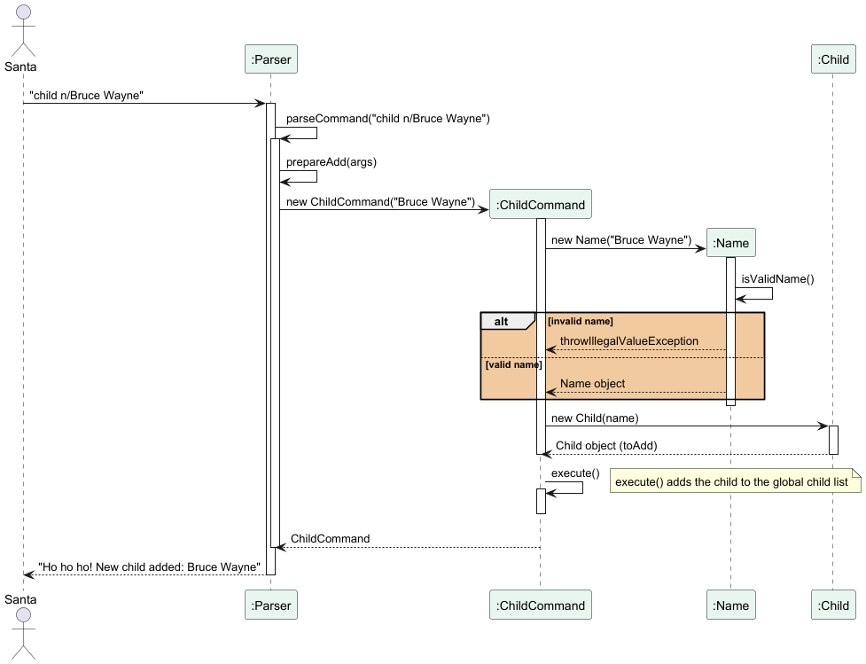
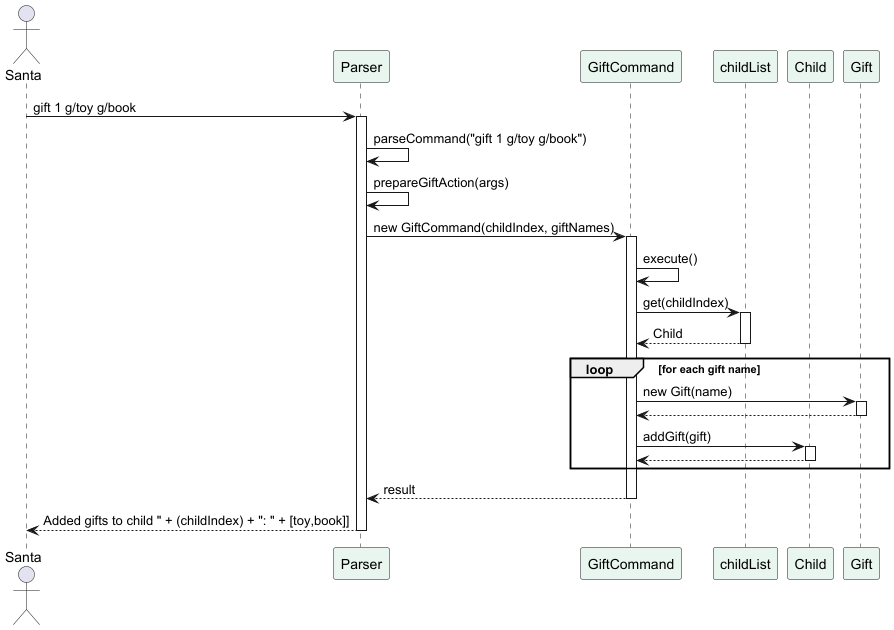
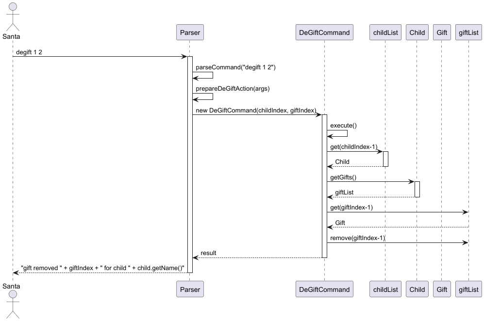
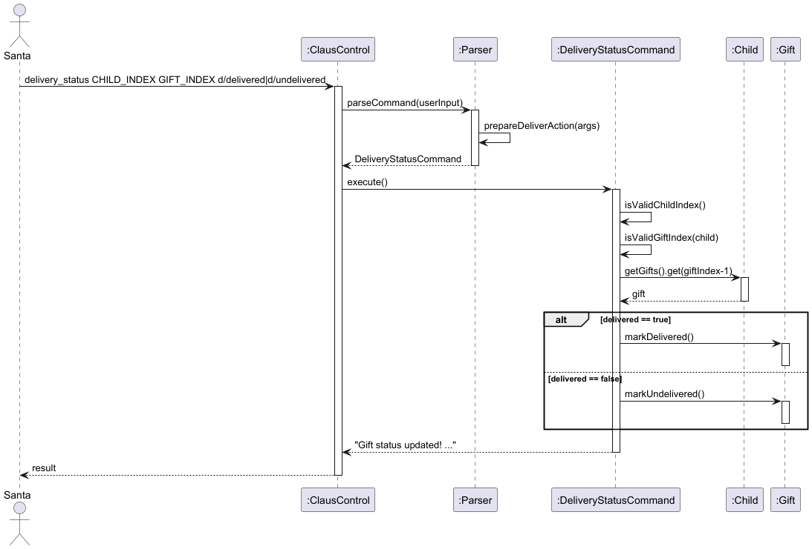
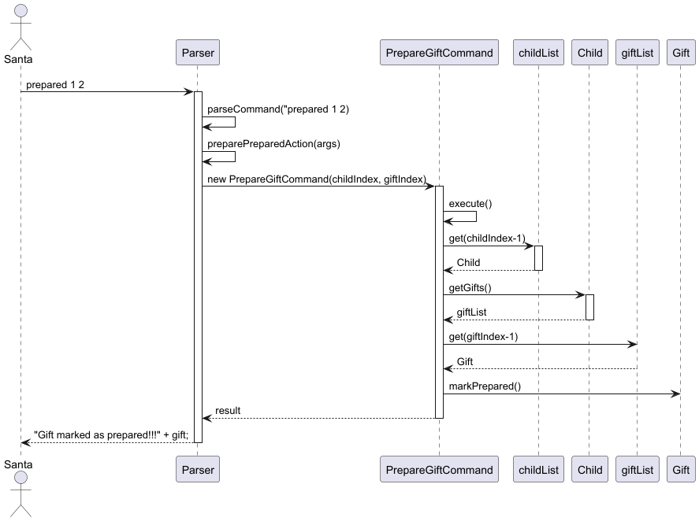
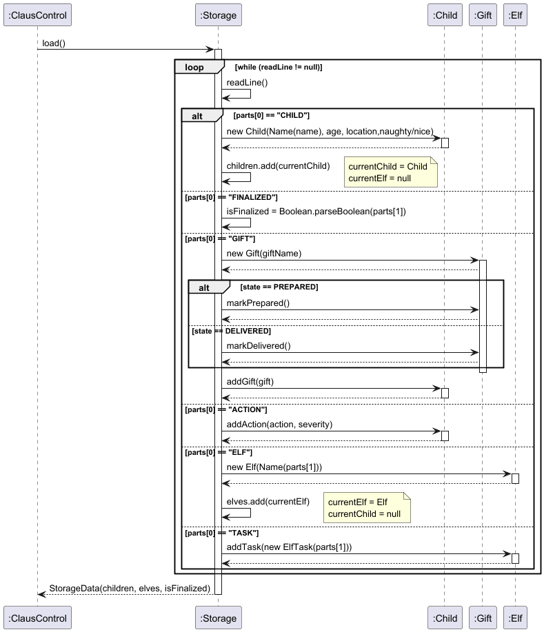
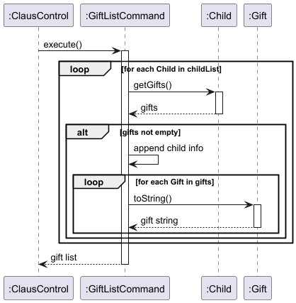

# Developer Guide

## Acknowledgements

* We, team CS2113-T09-2, acknowledge the use of the following sources in our tP.

| Source                                                                                              | Extent of reuse                                                                                                                                                                                                                                                                                                                                                                                                                                                                                                                                                                                                                                                                                                                                                                                                                                 | 
|:----------------------------------------------------------------------------------------------------|:------------------------------------------------------------------------------------------------------------------------------------------------------------------------------------------------------------------------------------------------------------------------------------------------------------------------------------------------------------------------------------------------------------------------------------------------------------------------------------------------------------------------------------------------------------------------------------------------------------------------------------------------------------------------------------------------------------------------------------------------------------------------------------------------------------------------------------------------|
| **[AddressBook-Level2 (AB2)](https://github.com/se-edu/addressbook-level2/)**                       | The class Child was inspired by the Person class of AB2. The class EditCommandTest was inspired by the AddCommandTest class of AB2.   The class ClausControl was adapted from the Main class of AB2 with some modifications. The class Command was adapted from the addCommand class of AB2 with some modifications. The class ChildCommand was adapted from the AddCommand class of AB2 with some modifications.  The class TextUi was reused from the TextUi class of AB2 with minor modifications. The class IllegalValueException was reused from the IllegalValueException class of AB2 with minor modifications. The class Name was reused from the Name class of AB2 with minor modifications. The class ReadOnlyChild was reused from the ReadOnlyPerson class of AB2 with minor modifications. | 
| **[AddressBook-Level3 (AB3)](https://github.com/se-edu/addressbook-level3/)**                       | The docs of our tP (AboutUs, README, UG, DG & PPPs) were made with reference to the AB3 application's docs.                                                                                                                                                                                                                                                                                                                                                                                                                                                                                                                                                                                                                                                                                                                                     |
| **[iP (author: shrabasti-c)](https://github.com/shrabasti-c/ip)**                       | The structure of class ChildCommand was adapted from the *Command classes of shrabasti-c's iP with some modifications.                                                                                                                                                                                                                                                                                                                                                                                                                                                                                                                                                                                                                                                                                                                          |
| **[GeeksforGeeks JUnit tests](https://www.geeksforgeeks.org/advance-java/unit-testing-of-system-out-println-with-junit/)**                      | The class ClausControlTest was inspired by the JUnit tests on the aforementioned website.                                                                                                                                                                                                                                                                                                                                                                                                                                                                                                                                                                                                                                                                                                                                                       |
| **ChatGPT**                                                                                         | The load() function of Storage class was written with the aid of ChatGPT.   The prepareAdd() and prepareEdit() functions of the Parser class (along with their refactored helpers) were reused from ChatGPT with significant modifications. ChatGPT was also used for trivial debugging.                                                                                                                                                                                                                                                                                                                                                                                                                                                                                                                                                    |
| **Claude**                                                                                          | The tool was used for trivial debugging of ParserTest class after a merge conflict.                                                                                                                                                                                                                                                                                                                                                                                                                                                                                                                                                                                                                                                                                                                                                             |

## Design & implementation

### Finalize Feature (Shubhan Gabra)

#### Overview
The "finalize" command freezes the nice and naughty lists, preventing further
action changes and enabling gift allocation.

#### Implementation
The finalize feature uses a boolean flag "isFinalized" that is stored in Duke.java.
This flag is passed to every command via setData() in Command.java.
When the user types "finalize", FinalizeCommand.execute() returns a success message.
Duke then detects it via instanceof FinalizeCommand and sets the flag to true.

ActionCommand, GiftCommand and ReassignCommand each check "isFinalized"
at the start of execute(). Once finalized, action additions and reassignments
are blocked since the lists are frozen. Gift allocation is also blocked
before finalization since gifts should only be assigned after the lists are set.

#### Why this way?
The instanceof approach was chosen to keep each command class simple and focused.
Other options like passing a mutable wrapper object or using a static field were
considered but not used as they were less readable or harder to test.

Given below is an example usage scenario:

1. Add a child: child n/Tom  
2. Try adding a gift: gift 1 g/toy: should be blocked  
3. Add an action: action 1 a/helped grandma s/2  
4. Finalize: finalize  
5. Try adding another action: should be blocked  
6. Add a gift: gift 1 g/toy: should work now

Given below is a sequence diagram showing how the finalize command works.

### Action Tracking Feature (Shubhan Gabra)

#### Overview
The "action" command allows Santa to record a good or bad action for a child
with an associated severity score between -5 and 5.

#### Implementation
Each Child object stores two ArrayLists, one for action descriptions and one
for severity scores. getTotalScore() sums all severities to determine if the
child is on the nice (score >= 0) or naughty (score < 0) list.

Format: action CHILD_INDEX a/ACTION s/SEVERITY

The following steps occur:
1. Parser extracts the child index, action description and severity.
2. ActionCommand checks if the lists are finalised. If so, the action is blocked.
3. The child index is validated.
4. The action and severity are added to the child via addAction().

#### Why this way?
Storing actions and severities in parallel ArrayLists keeps the data simple
and makes getTotalScore() a straightforward loop. Alternatives like a single
ArrayList of Action objects were considered but rejected for added complexity.

Given below is a sequence diagram showing how the action command works.

### Nice and Naughty List Feature (Shubhan Gabra)

#### Overview
The "nice" and "naughty" commands list all children whose total action score
is >= 0 or < 0 respectively. Manual overrides via "reassign" take priority
over the score-based classification.

#### Implementation
Both NiceCommand and NaughtyCommand loop through the childList and call
isNice() or isNaughty() on each child. These methods check the listAssignment
field first. If it is not null, the manual override is used. Otherwise the
total score determines the list.

### Reassign Feature (Shubhan Gabra)

#### Overview
The "reassign" command allows Santa to manually override a child's list
assignment to either nice or naughty, regardless of their action score.
Once finalised, reassignment is blocked.

#### Implementation
ReassignCommand calls setListAssignment() on the child, which sets the
listAssignment field in Child. This field is checked first in isNice()
and isNaughty(), so it always takes priority over the computed score.

Format: reassign CHILD_INDEX l/LIST

### Todo and Reminder Feature (Shubhan Gabra)

#### Overview
The "todo" command allows Santa to add tasks with deadlines. On startup,
any todos due within the next 7 days are automatically shown as reminders.
Todos are persisted across sessions using TodoStorage.

#### Implementation
Each Todo stores a description and a LocalDate deadline. TodoStorage saves
and loads todos from todos.txt using a pipe-separated format.

The following steps occur when adding a todo:
1. Parser extracts the description and deadline from the input.
2. AddTodoCommand validates the description is not empty.
3. AddTodoCommand validates the deadline is not in the past.
4. The todo is added to the todoList and saved via TodoStorage.

On startup, ClausControl calls showUpcomingTodos() which filters todos
using isUpcoming(), showing only those due within 7 days.

Format: todo d/DESCRIPTION by/YYYY-MM-DD

#### Why this way?
LocalDate was chosen over epoch seconds since only date precision is needed.
A separate TodoStorage file was created to avoid modifying the existing
Storage class written by another team member.

**Alternatives considered:**
- Storing todos in the same data.txt file was rejected to avoid coupling
  with the existing storage format.
- Using epoch seconds was rejected as unnecessary since deadlines are
  date-based, not time-based.

### Add Child Feature (Chakraborty Shrabasti)

#### Overview
The `child` command creates a child entity/profile consisting of its name and location.

#### Implementation
The proposed child profile is facilitated by `Child` Class. 
It implements `ReadOnlyChild` which contains a name fetching mechanism, the name being stored internally via a `Name` class with a reference to a `name` String input by the user.
The child operation must minimally have a name argument i.e. location, etc. are optional.
Additionally, it implements the following operations:
* `toAdd()`—adds the child to the internal child list.
* `execute()`—returns a successful operation message.
These operations comprise the `ChildCommand` class (which inherits from a base `Command` class).
Given below is an example usage scenario and how the add child mechanism behaves at each step.
1. The user launches the application for the first time.
2. The user executes `child n/Bruce Wayne` to add a child in the child list.
3. The Parser parses the command and returns the arguments to a new `ChildCommand`.
4. Given a valid Name the `Child` object is instantiated and returned.
* Note: At the point of instantiation the Name is validated. An incorrect input means the object creation does not proceed.
5. The `Child` is added to the Child List.
6. The successful message is displayed.

Given below is a sequence diagram describing the child operation (happy path).

**Aspect:** How to implement the Child Profile  
  - **Alternative 1 (current choice):** Construct a `ReadOnlyChild` interface which implements `Child`  
    - **Pros:** Ensures no external access as well as immutability  
    - **Cons:** More lines of code and more complex implementation (extra interface)  

  - **Alternative 2:** Implement via a Single `Child` Class  
    - **Pros:** Lesser lines of code and simpler implementation  
    - **Cons:** Higher risk of child data modification  

 **Aspect:** How to store the Child Name  
  - **Alternative 1 (current choice):** Store as `Name` class  
    - **Pros:** Ensures validation at time of object creation  
    - **Cons:** More lines of code and more complex implementation (extra class)  

  - **Alternative 2:** Store as `String` in `Child` class  
    - **Pros:** Lesser lines of code and simpler implementation  
    - **Cons:** No enforced validation and violation of Separation of Concerns  

### Add Elf Feature (XIAO Yanjing)

#### Overview
The "elf" command creates an elf entity consisting of its name and task(initialized as null).

#### Implementation
The proposed elf profile is facilitated by Elf Class.
It implements ReadOnlyElf with a name fetching mechanism, stored internally with a Name class with a reference to a name String input by the user.
Given below is an example usage scenario and how the add elf mechanism behaves at each step.
Step 1. The user launches the application for the first time.
Step 2. The user executes elf n/Buddy to add an elf in the elf list.

### Add gift feature(Prerana Ravi Shankar)

#### Overview
The gift feature allows Santa to assign one or a list of gifts to a child. The gifts are assigned "in progress" status on assignment.
This allows Santa to manage the gifts assigned to children.

#### Implementation
This feature is implemented with the GiftCommand class.
When Santa enters "gift [child index] g/[gift name]" the Parser extracts the following-
1. The child index
2. The list of gifts prefixed with g/.

A GiftCommand object is created with the above parameters.
The following steps occur-
1. The command checks whether the lists have been finalised.
2. The child index is checked to ensure it is a numeral.
3. The child is retrieved from childList.
4. For each gift, a new Gift object is created and the gift is added to the child with addGift() method.
5. The gift is assigned the "in progress" status upon assignment.

#### UML Diagram- Sequence Diagram
Given below is the sequence diagram

**Aspect:** How to implement the Gift feature
  - **Alternative 1 (current choice):** Allowing multiple gifts to be added in one command
    - **Pros:** User friendly as it supports multiple entries at once.
    - **Cons:** Parsing is complex.
  - **Alternative 2:** Allow single gift assignment per command.
    - **Pros:** Implementing this feature is simpler.
    - **Cons:** Not as user-friendly since multiple assignment is not supported.

### Degift feature(Prerana Ravi Shankar)

#### Overview
This feature allows Santa to remove a gift for a particular child. This is useful since it helps Santa update the giftlist.

#### Implementation
This feature is implemented with the DeGiftCommand class.
When Santa enters "degift [child index] [gift index]" the Parser extracts the following-
1. The child index
2. The gift index

A DeGiftCommand object is created with the above parameters.
The following steps occur- 
1. The child index is checked to ensure it is a numeral.
2. The child is retrieved from childList.
3. The command validates the gift index.
4. The gift is removed from the child's gift list.
5. The gift is removed using remove(giftIndex-1)

Appropriate error messages are returned in case a check fails.

#### UML Diagram- Sequence Diagram
Given below is the sequence diagram

**Aspect:** How to implement the DeGift feature
  - **Alternative 1 (current choice):** Remove gift from child list
    - **Pros:** Simple to implement.
    - **Cons:** Requires proper error handling
  - **Alternative 2:** Remove gift by name
    - **Pros:** User friendly as the user need not refer to indexes.
    - **Cons:** Increases complexity of the code.

### Gift delivery status (Prerana Ravi Shankar)

#### Overview
This feature allows Santa to set the gift status as delivered or undelivered. This is useful as it allows Santa to plan the gift deliveries by
updating the delivery status.

#### Implementation
This feature is implemented with the DeliveryStatusCommand class.
When Santa enters "delivery_status [child index] [gift index] d/delivered/undelivered" the Parser extracts the following-
1. The child index
2. The gift index
3. delivery status

A DeliveryStatusCommand object is created with the above parameters.
The following steps occur-
1. The child index is checked to ensure it is a numeral.
2. The child is retrieved from childList.
3. The command validates the gift index.
4. The gift is retrieved from the child's giftlist.
5. The gift status is updated- markDelivered() if delivered=true and markUndelivered() when delivered=false;

Appropriate error messages are returned in case a check fails.

#### UML Diagram- Sequence Diagram
Given below is the sequence diagram

**Aspect:** How to implement the Delivery Status feature
  - **Alternative 1 (current choice):** Use a boolean variable to determine action
    - **Pros:** Simple to implement.
    - **Cons:** Less intuitive as the parameter is not clearly understandable without looking at it's implementation.
  - **Alternative 2:** Using two command objects for delivered and undelivered actions.
    - **Pros:** User friendly.
    - **Cons:** Breaks encapsulation.

### Prepare Gift Feature (Prerana Ravi Shankar)

#### Overview
This feature allows Santa to set a gift status as prepared. This is to indicate that the gift is prepared and not delivered yet.
This allows Santa to track the progress of gifts.

#### Implementation
This feature is implemented with the PrepareGiftCommand class.
When Santa enters "prepared [child index] [gift index] " the Parser extracts the following-
1. The child index
2. The gift index

A PrepareGiftCommand object is created with the above parameters.
The following steps occur-
1. The command retrieves the child from the childlist.
2. The list of gifts are retrieved using the getGifts() method.
3. The gift as per the specified gift index is retrieved.
4. the method markPrepared() is called on the gift.

#### UML Diagram- Sequence Diagram
Given below is the sequence diagram

**Aspect:** How to implement the Prepare feature
  - **Alternative 1 (current choice):** Use a separate class for Prepare command
    - **Pros:** Clear separation of responsibilities.
    - **Cons:** Additional class required.
  - **Alternative 2:** Merge the command into deliveryStatus command.
    - **Pros:** Fewer classes.
    - **Cons:** Increases complexity of conditional logic.

### Storage  (Prerana Ravi Shankar)

#### Overview
This component saves the data in the application and reloads it upon running the application.
It stores:
1. Child name
2. Gift name/s
3. Actions and severities
4. Elves and elf tasks

#### Implementation
**Saving data**
The save() method writes the lists into a .txt file in a structured format.
1. Each child's name is written with the CHILD tag.
2. The corresponding gifts of the child are written just below it with the GIFT tag.
3. The child's actions and severities are stores with the ACTION tag.
4. Each elf is written with the ELF tag.
5. The corresponding elf tasks are written under it with the TASK tag.

**Loading data**
The load() method reconstructs data from the .txt file.
1. It reads the file line by line.
2. Splits each line using "|".
3. Processes:
   "CHILD" → creates new Child
   "GIFT" → creates new Gift and restores the status of the gift.
   "ACTION" → restores an action and its severity
   "ELF" → creates a new Elf 
   "TASK" → adds a ElfTask
4. Restores gift state:
   PREPARED → markPrepared()
   DELIVERED → markDelivered()
   default → remains IN_PROGRESS
5. Adds gift to the current child

#### UML Diagram- Sequence Diagram
Given below is the sequence diagram 

**Aspect:** How to implement the Storage feature
  - **Alternative 1 (current choice):** Simple .txt file used to store data
    - **Pros:** Human-readable file.
    - **Cons:** Less structures.
  - **Alternative 2:** JSON format
    - **Pros:** Structured.
    - **Cons:** Requires external libraries.

### GiftList Feature  (Prerana Ravi Shankar)

#### Overview
The giftlist feature displays all the gifts assigned to a child along with the child name. This allows Santa to view all the gifts in a structured format.

#### Implementation
This feature is implemented with the GiftListCommand class.
When Santa enters "giftlist " the Parser creates a GiftListCommand object.
*Only children with assigned gifts are displayed in the giftlist.*

1. The command checks if childList is empty.
2. It iterates through each child in the childList.
3. For each child, the list of gifts are retrieved using the getGifts() method.
4. The child's name and index are appended to the output.
5. The createList() method iterates through each gift and appends the gift index and gift details to the output.
6. If no gifts are assigned to any child, an appropriate error message is displayed.

#### UML Diagram- Sequence Diagram
Given below is the sequence diagram.

**Aspect:** How to implement the GiftList feature
- **Alternative 1 (current choice):** Iterate through childlist and display children with assigned gifts.
    - **Pros:** Output is relevant and shows useful information.
    - **Cons:** Children without gifts are not displayed.
- **Alternative 2:** Display all children regardless or whether gifts are assigned or not.
    - **Pros:** Provides a complete overview of all children details.
    - **Cons:** Output may look messy.

## Product scope
### Target user profile

Santa Claus [single user]

### Value proposition

{Describe the value proposition: what problem does it solve?}

## User Stories

|Version| As a ... | I want to ... | So that I can ...|
|--------|------|--------------|------------------|
|v1.0| Santa|Assign gifts to all children|I can spread christmas cheer|
|v1.0| Santa|Edit gifts - add/remove|I can correct my list if i make mistakes|
|v1.0| Santa|Mark/unmark gifts as delivered/not delivered|I can keep track of my delivery list|
|v1.0| Santa|See list of gifts|I can allocate the budget appropriately|
|v2.0| user |find a to-do item by name|locate a to-do without having to go through the entire list|

## Non-Functional Requirements

## Glossary

* **Elf**: A system entity representing a staff member or volunteer.
* **Child**: A system entity representing a recipient or target user.
* **CLI**: Command Line Interface; an interface where users type commands to interact with the software.
* **Index**: A unique numerical identifier assigned to an item in the current displayed list.

## Instructions for manual testing

#### Initial Launch
1. Download the `.jar` file and place it in an empty folder.
2. Run `java -jar duke.jar`. The GUI should load with a sample message.

#### Testing Elf Commands
1. **Adding:** Type `elf n/Buddy`. Verify "Buddy" appears in the `elflist`.
2. **Editing:** Type `Editelf e/1 n/Dobby`. Verify the first Elf's name changes to "Dobby".
3. **Deleting:** Type `rmelf e/1`. Verify the Elf is removed.

#### Testing Find Functionality
1. Ensure you have children data loaded (use `childlist` to check).
2. Type `find l/Singapore`.
3. **Expected Result:** Only children with the location "Singapore" are displayed in the list.
