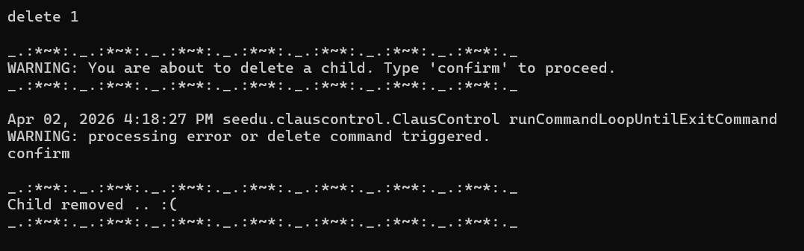

ClausControl is a **desktop app for Santa Claus to manage children, gifts, elves and deadlines, optimized for use via a Command Line Interface** (CLI) while still having the benefits of a Graphical User Interface (GUI). If Santa can type fast, ClausControl can get his management tasks done faster than traditional GUI apps.

--------------------------------------------------------------------------------------------------------------------

## Quick Start

1. Ensure that you have **Java 17** or above installed on your computer. 
   **Mac users:** Ensure you have the precise JDK version prescribed [here](https://se-education.org/guides/tutorials/javaInstallationMac.html).
2. Download the latest version of `ClausControl` (`.jar` file) from [here](https://github.com/AY2526S2-CS2113-T09-2/tp).
3. Open your terminal, navigate to the folder where the file is located, and run the command: `java -jar clauscontrol.jar`.
4. Refer to the Features below for details of each command.

--------------------------------------------------------------------------------------------------------------------
## Features

**! Notes about the command format:** 

* Words in `UPPER_CASE` are the parameters to be supplied by the user. 
  e.g. in `child n/NAME`, `NAME` is a parameter which can be used as `add n/Peter Parker`.

* Items in square brackets are optional. 
  e.g. `n/NAME [l/LOCATION]` can be used as `n/Peter Parker l/New York` or as `n/Peter Parker`.

* Items with … after them can be used multiple times but minimally one time. e.g. `degift CHILD_INDEX GIFT_INDEX...`… can be used as `degift 1 1` (i.e. 1 time), `degift 1 1 2 3` etc. 

* Parameters can be in any order. 
  e.g. if the command specifies `n/NAME l/LOCATION a/AGE`, `a/AGE l/LOCATION n/NAME` is also acceptable.

* Extraneous parameters for commands that do not take in parameters (such as `nice`, `naughty`, etc.) will be ignored. 
  e.g. if the command specifies `nice 123`, it will be interpreted as `nice`.

* Inputs with prefix explicitly specified must have valid parameters following the prefix. 
  e.g. even though the location field is optional in the `child` command , `child n/Eddie Brock l/` is not a valid command as location is not specified.

### Child Profile

#### Adding a child: `child`
Adds a child to the system. 

* Format: `child n/NAME [l/LOCATION] [a/AGE]`

Examples:
* `child n/Peter Parker`
* `child n/Peter Parker a/16 l/New York`

#### Editing a child: `edit`
Edits an existing child in the system.

* Format: `edit CHILD_INDEX n/NAME [l/LOCATION] [a/AGE]`
* Edits the child at the specified CHILD_INDEX. The index refers to the index number shown in the displayed child list. The index **must be a positive integer** 1, 2, 3, …
* At least one of the optional fields must be provided. 
* Existing values will be updated to the input values.
* Note: A child can be edited as long as the lists are not finalized.

Examples:
* `edit 1 n/Eddie Brock` Edits the name of the 1st child to be Eddie Brock.
* `edit 2 l/Manhattan a/30` Edits the location and age of the 2nd child to be Manhattan and 30 respectively.

#### Viewing a child: `view`
Displays the attributes of an existing child in the system.

* Format: `view CHILD_INDEX`
* Displays the name, age, location, gift/s, actions with associated severities, number of gifts, and current list assignment (naughty/nice) of the child at the specified CHILD_INDEX. The index refers to the index number shown in the displayed child list. The index **must be a positive integer** 1, 2, 3, …
* Attributes (age/location) not supplied by the user will be displayed as such (for example, if location is not specified, it will display **Location: Not Provided**)
* Gifts and actions (with severities) will only be displayed after assignment of the same by the user.
* In the absence of action severities, the status will reflect the following: **List Assignment: Yet to be evaluated/assigned.**

Examples:
* `view 1` Displays the attributes of first child

#### Deleting a child: `delete`
Deletes the specified child from the address book.

* Format: `delete CHILD_INDEX`
* Deletes the child at the specified CHILD_INDEX. The index refers to the index number shown in the displayed child list. The index **must be a positive integer** 1, 2, 3, …
* Due to the sensitive nature of the command, a warning is issued wherein a user has to further `confirm` the deletion of a child profile by typing `confirm` after the delete command.
* The following workflow is provided for the user's/tester's reference (delete, followed by confirm).
   

### Action Tracking

#### Adding an action: `action`
Records a good or bad action for a child with a severity score.

* Format: `action CHILD_INDEX a/ACTION s/SEVERITY`
* SEVERITY must be an integer between -5 and 5
* Positive severity = good action, Negative severity = bad action
* Cannot add actions after `finalize` has been called

Examples:
* `action 1 a/helped grandma s/2`
* `action 2 a/broke window s/-3`

### Nice and Naughty Lists

#### Viewing the nice list: `nice`
Displays all children with a total action score >= 0.

* Format: `nice`

#### Viewing the naughty list: `naughty`
Displays all children with a total action score < 0.

* Format: `naughty`

#### Reassigning a child: `reassign`
Manually overrides a child's list assignment to either nice or naughty.
This override takes priority over the score-based classification.
Cannot reassign after `finalize` has been called.

* Format: `reassign CHILD_INDEX l/LIST`
* LIST must be either `nice` or `naughty`

Examples:
* `reassign 1 l/nice`
* `reassign 2 l/naughty`

### Finalizing Lists

#### Finalizing the lists: `finalize`
Freezes the nice and naughty lists. Once finalized:
* No more actions can be added
* No more reassignments can be made
* Gift allocation is now enabled

* Format: `finalize` or `finalise`

### Elf Management

#### Adding an elf: `elf`
Adds a new elf to the system records.
* Format: `elf n/NAME`
* Example: `elf n/Buddy`

#### Removing an elf: `rmelf`
Removes an existing elf based on their index in the list.
You can use 'elflist' command to see the elf index.
* Format: `rmelf e/ELF_INDEX`
* Example: `rmelf e/1`

#### Editing an elf: `editelf`
Updates the name of an existing elf identified by their index.
The elf_index must be valid (ie, integer larger than 0, mapped to existing elf).
You can use 'elflist' command to see the elf index.
* Format: `editelf e/ELF_INDEX n/ELF_NEW_NAME`
* Example: `editelf e/1 n/Legolas`

#### Assigning a task to an elf: `task`
Assigns a task to an existing elf.

Format: `task ELF_INDEX t/TASK_DESCRIPTION`  
Example: `task 1 t/wrap gifts`

#### Removing a task from an elf: `detask`
Removes a task from an existing elf. Due to the sensitive nature of the command, a warning
is issued wherein the user has to confirm the removal by typing `confirm`.

Format: `detask e/ELF_INDEX t/TASK_INDEX`  
Example: `detask e/1 t/1`

### Listing Entities

#### Listing children: `childlist`
Displays a complete list of all children currently in the database.
* Format: `childlist`
* Example: `childlist`
Display the following:

Here are all children:
1. Alice
2. Bob

#### Listing elves: `elflist`
Displays a complete list of all elves and their task currently in the database.
* Format: `elflist`
* Example: `elflist`

Display the following:

Here are all elves and their tasks:
1. Bobby [No tasks assigned]
2. Dobby
   Tasks:
  - 1: Buy Candy

### Finding Children

#### Finding by name: `find n/`
Searches for children matching the specified name.
* Format: `find n/NAME`
* Example: `find n/James Jake`

#### Finding by age: `find a/`
Searches for children who match a specific age.
* Format: `find a/AGE`
* Example: `find a/11`

#### Finding by location: `find l/`
Searches for children based on their registered location.
* Format: `find l/LOCATION`
* Example: `find l/Singapore`

### Gift Management

#### Add gift: `gift`
Assigns a single gift or multiple gifts at a time to a child.
* Format: `gift CHILD_INDEX g/GIFT.. `
* Assigns gifts to children according to the specified CHILD_INDEX. The index refers to the index number shown in the displayed child list. The index must be a positive integer 1, 2, 3, …​

Examples:
* `gift 1 g/toy g/chocolate g/book `
* `gift 3 g/book`

#### Remove gift: `degift`
Removes a gift assigned to a child.

**Only an undelivered/prepared gift can be degifted. Gift marked as delivered cannot be degifted.**
* Format: `degift CHILD_INDEX GIFT_INDEX`
* The user inputs the child index and gift index. 
* Removes the gift from the gift list using the input child index and gift index. 
* The index must be a positive integer 1, 2, 3... 
Example:
* `degift 1 2`

#### Update delivery status: `delivery_status`
Assigns delivery status of gifts as delivered/undelivered.

**If a gift is not delivered, it is assumed as undelivered.**
* Format: `delivery_status CHILD_INDEX GIFT_INDEX d/[status] `
* The user inputs the child index, gift index and delivery status. 
* Assigns delivery status (delivered/undelivered) to a gift in the gift list based on the input child index and gift index. 
* The index must be a positive integer 1, 2, 3
Example:
* `delivery_status 1 2 d/delivered`
* `delivery_status 1 1 d/undelivered`

#### View gift list: `giftlist`
Displays all gifts assigned to children.
* Format: `giftlist`
Example: 
* `giftlist`
Displays the following:
toy
book

#### Mark gift as prepared: `prepared`
Marks a gift which is prepared but not delivered yet.
**If a gift is neither marked as prepared or delivered, it is assumed as undelivered.**
* Format: `prepared CHILD_INDEX GIFT_INDEX `
* The user inputs the child index, gift index. The index must be a positive integer 1, 2, 3
Example:
* `prepared 1 2`

### Todo List

#### Adding a todo: `todo`
Adds a task with a deadline to Santa's todo list.
Todos due within the next 7 days are shown as reminders on startup.

* Format: `todo d/DESCRIPTION by/YYYY-MM-DD`
* Deadline must not be in the past
* Description cannot be empty

Examples:
* `todo d/Buy wrapping paper by/2026-12-20`
* `todo d/Pack gifts by/2026-12-24`

#### Editing a todo: `edittodo`
Edits a task with a deadline to Santa's todo list.

* Format: `edittodo TASK_INDEX [d/DESCRIPTION] [by/YYYY-MM-DD]`
* Edits the task at the specified TASK_INDEX. The index refers to the index number shown in the displayed todo list. The index **must be a positive integer** 1, 2, 3, …
* Either one of the parameters (description/deadline) must be provided.

Examples:
* `edittodo 1 d/Buy more gifts` Edits the description of the 1st task as specified.
* `edittodo 2 by/2026-12-05` Edits the deadline of the 2nd task as specified.

#### Viewing all todos: `todolist`
Displays all todos with their deadlines.

* Format: `todolist`

#### Removing a todo: `removetodo`
Removes a todo from the list by its index.

* Format: `removetodo INDEX`

Examples:
* `removetodo 1`

### Termination
#### Reset Command: `reset`
Resets the application (all lists) to initial state.

* Format: `reset`

#### Exit Command: `bye`
Exits the application.

* Format: `bye`

#### Storage
Stores data in a txt file which allows retrieval of lists upon restarting the application.

## FAQ

**Q**: How do I transfer my data to another computer?

**A**: All your data is automatically saved in a local `data` folder within the same directory as the `.jar` file. Simply copy the entire folder and the `.jar` file to the new computer to resume where you left off.

## Command Summary

| Action                     | Format                                            | Example                                 |
|:---------------------------|:--------------------------------------------------|:----------------------------------------|
| **Add Child**              | `child n/NAME [l/LOCATION] [a/AGE]`               | `child n/Peter Parker a/16 l/New York`  |
| **Edit Child**             | `edit CHILD_INDEX [n/NAME] [l/LOCATION] [a/AGE]`  | `edit 1 n/Eddie Brock`                  |
| **View Child**             | `view CHILD_INDEX`                                | `view 1`                                |
| **Delete Child**           | `delete CHILD_INDEX`                              | `delete 1`                              |
| **Add action**             | `action CHILD_INDEX a/ACTION s/SEVERITY`          | `action 1 a/helped grandma s/2`         |
| **View nice list**         | `nice`                                            | `nice`                                  |
| **View naughty list**      | `naughty`                                         | `naughty`                               |
| **Reassign child**         | `reassign CHILD_INDEX l/LIST`                     | `reassign 1 l/nice`                     |
| **Finalize lists**         | `finalize`                                        | `finalize`                              |
| **Add Elf**                | `elf n/NAME`                                      | `elf n/Dobby`                           |
| **Remove Elf**             | `rmelf e/INDEX`                                   | `rmelf e/1`                             |
| **Edit Elf**               | `editelf e/INDEX n/NEW_NAME`                      | `editelf e/2 n/Zobby`                   |
| **Assign Elf Task**        | `task ELF_INDEX t/TASK_DESCRIPTION`               | `task 1 t/wrap gifts`                   |
| **Remove Elf Task**        | `detask e/ELF_INDEX t/TASK_INDEX`                 | `detask e/1 t/1`                        |
| **List Children**          | `childlist`                                       | `childlist`                             |
| **List Elves**             | `elflist`                                         | `elflist`                               |
| **Find by Name**           | `find n/NAME`                                     | `find n/James Jake`                     |
| **Find by Age**            | `find a/AGE`                                      | `find a/11`                             |
| **Find by Location**       | `find l/LOCATION`                                 | `find l/Singapore`                      |
| **Add Gift**               | `gift CHILD_INDEX g/GIFT..`                       | `gift 1 g/toy`                          |
| **Remove gift**            | `degift CHILD_INDEX GIFT_INDEX`                   | `degift 1 2`                            |
| **Update delivery status** | `delivery_status CHILD_INDEX GIFT_INDEX d/status` | `delivery_status 1 2 d/delivered`       |
| **Mark prepared gift**     | `prepared CHILD_INDEX GIFT_INDEX`                 | `prepared 1 2`                          |
| **View giftlist**          | `giftlist`                                        | `giftlist`                              |
| **Add todo**               | `todo d/DESCRIPTION by/YYYY-MM-DD`                | `todo d/Buy gifts by/2026-12-20`        |
| **Edit todo**              | `edittodo INDEX [d/DESCRIPTION] [by/YYYY-MM-DD]`  | `edittodo 1 d/Wrap gifts by/2026-12-22` |
| **View todos**             | `todolist`                                        | `todolist`                              |
| **Remove todo**            | `removetodo INDEX`                                | `removetodo 1`                          |
| **Reset Application**      | `reset`                                           | `reset`                                 |
| **Exit Application**       | `bye`                                             | `bye`                                   |